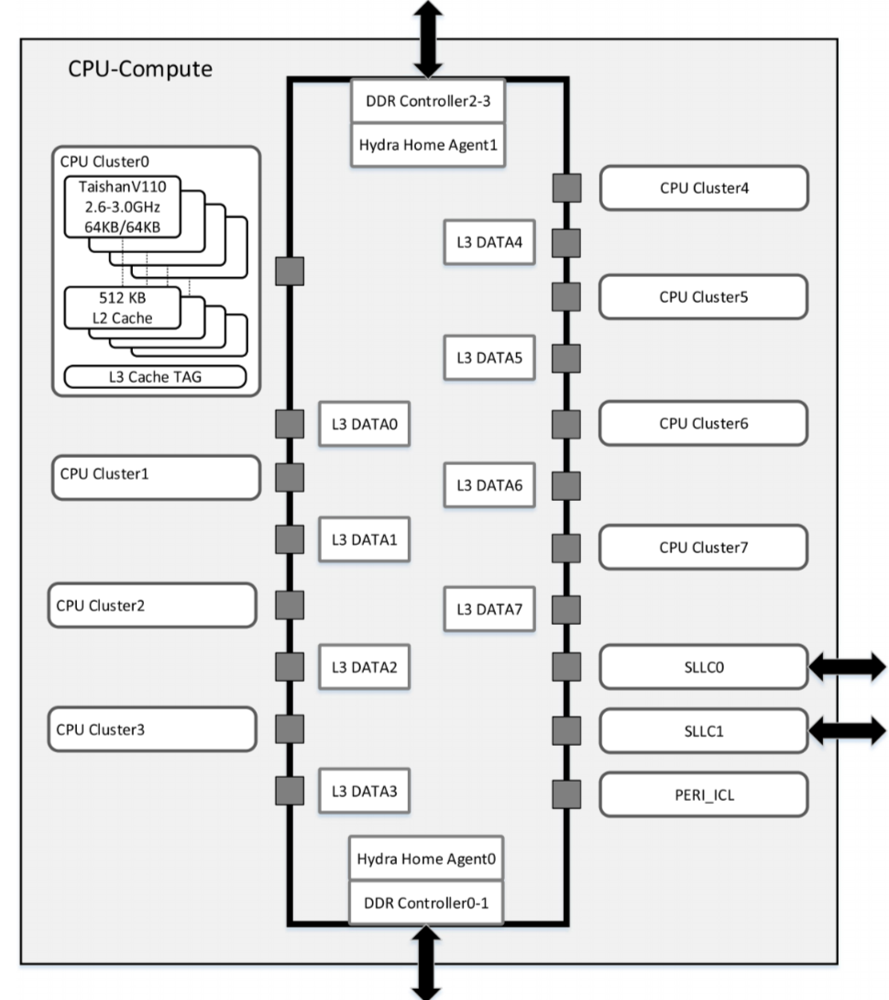

## 鲲鹏处理器

### 冯·诺依曼架构&哈佛架构的区别

主要的区别就是冯·诺依曼架构（X86）的指令和数据存储在同一个存储器中，并使用同一套总线进行数据传输，而在哈佛架构（ARMv8）中，指令[存储器](https://so.csdn.net/so/search?q=存储器&spm=1001.2101.3001.7020)和数据存储器是物理上分开的，使用不同的总线进行数据传输。

### 指令集： RISC和CISC

#### RISC reduced instruction set computing

大幅简化架构，仅保留所需要的指令集，可以让整个处理更为简化，拥有小体积、高效能的特性。<u>指令集使用NEON扩展结构</u>

#### CISC complex instruction set computing

以增加处理器本身复杂度为代价换取更高的性能。<u>X86指令集从MMX发展到了SSE，AVX。</u>

### 鲲鹏920 芯片规格

- 指令兼容ARMv8.2， 最高主频3.0GHz
- L1 L2 L3 cache大小
- 8 * DDR4 ， 每个内存条频率最高2933MB/S

### 鲲鹏920芯片架构

​	鲲鹏920采用乐高架构，CPU core和I/O位于不同的Die（晶圆），最后合封为一个SoC，Die内通过ring环进行通信。其中芯片可以由，也可以由一个CPU Die + 一个I/O Die组成两个CPU Die + 一个I/O Die组成等。

​	CPU Cluster由4个核心和一个L3 cache tag组成，且每个核心由自己独享的L1和L2 cache。6-8个Cluster组成一个Die。

### 鲲鹏920芯片架构——cache模式

