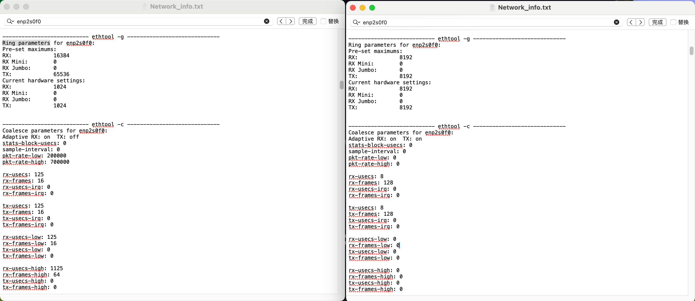
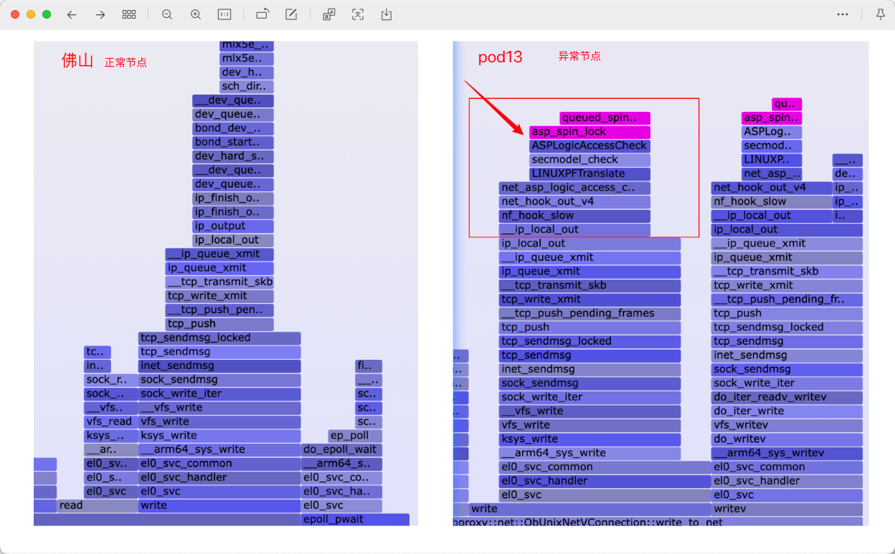
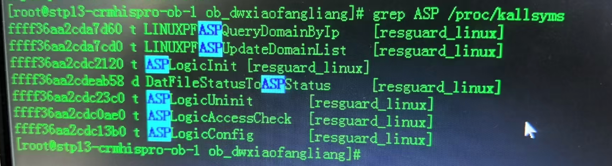
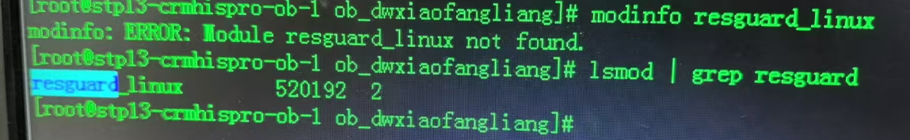
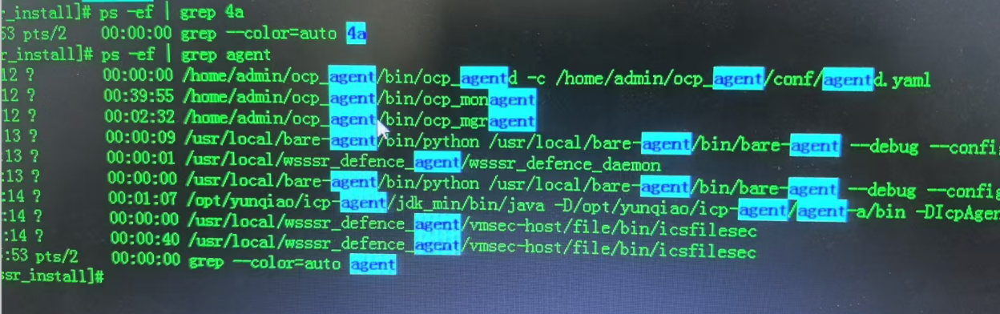
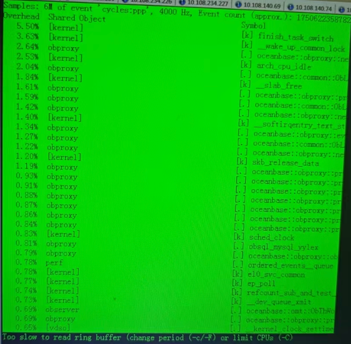

## 问题描述

​	广东移动客户反馈POD13的C3K和B1K机型在用sysbench压测时存在网卡软中断占用高的问题，但是POD2/9的C3K机型无该问题（均为arm服务器）。软中断过高的问题会导致服务器部署的OB数据库集群TPS/QPS只有正常性能的三分之一。客户尝试将网卡软中断打散到全部的CPU、也尝试中断绑核至numa0、调整ringbuffer、网卡队列数等操作，但是软中断依旧有占比高的问题。

​	【具体现象】中断队列数24，绑核绑在0-23核心，0-23核 软中断si几乎100%，us和sy几乎为0

## 测试场景

​	SysBench测试用例：点查 / 250张表 / 并发 800 / 每张表记录数10W / 只连接从zone 240机器的obproxy

## 环境配置

| 配置         | POD13_240 （异常节点）                         | POD13_226（异常节点）                          | POD2/9_145（正常节点）                         |
| ------------ | ---------------------------------------------- | ---------------------------------------------- | ---------------------------------------------- |
| OS           | BCLinux 21.10U3 LTS（4.19.90-2107.6.0.0192.8） | BCLinux 21.10U3 LTS（4.19.90-2107.6.0.0192.8） | BCLinux 21.10U3 LTS（4.19.90-2107.6.0.0192.8） |
| CPU          | 4 * 7260                                       | 4 * 7260                                       | 4 * 7260                                       |
| 网卡         | **SP681 2*25GE**                               | **Netswift RP1000P2SFP**                       | -                                              |
| 网卡驱动版本 | hinic3 17.6.9.2                                | -                                              | **Mlx5_core 5.0-0**                            |
| 网卡固件版本 | 15.19.2.10                                     | -                                              | 14.31.1014                                     |
| 软中断情况   | **24个核心软中断几乎都100%**                   | 24个核心软中断几乎都100%                       | **24个核心软中断30%**                          |

## 性能分析

### 1. 环境对比

​	POD13软中断过高的机器和POD2/9的机器均为arm机器，且POD13所有机器均存在问题，而非单独一台有问题，猜测是某个配置或者网卡驱动引入的问题，所以前期以配置的收集和对比检查为主。

#### 1.1 网络负载

​	检查CPU、磁盘、网络、内存是否存在瓶颈点，其中软中断24个cpu核心，si在100%；网络bond1 IO在30MB/s，不存在网络瓶颈。iperf3测试网络IO，可达1GB/s以上，且si不高。

​	其他参考网络IO测试命令：**tsar --tcp --traffic -l -i 5**  

#### 1.2 硬件配置&BIOS配置检查 （收集的信息如上一章节《环境配置》所示）

​	【网卡驱动问题排查】软中断问题，前期考虑可能是网卡版本差异或者网卡驱动引入的问题，所以首先收集的是网卡的型号和驱动版本信息。 异常和正常节点的网卡确实是不同型号的网卡，但是POD13异常节点中，包含SP681和Netswift两种类型的网卡。同一个资源池的不同厂商的网卡同时出现驱动问题，这个概率太低了，所以配置排查的重点转向运维人员前期做的arm调优项修改及一些网卡、中断相关参数配置。

​	【网卡、中断参数配置】检查了网卡均组的bond4作为业务口，且均为25GE网卡，未出现错误使用电口作为业务口的情况。排查到中断绑核、中断聚合参数和ringbuffer配置不一致，修改所有差异点，软中断过高问题未得到改善。

​	

​	尝试修改网卡队列数（24 -> 48），并绑网卡中断至0-47核，重新进行sysbench性能测试，软中断变成48个核心si 占比100%，sysbench性能提升100%，可以判断sysbench压测的阻塞点主要在软中断的处理上。

​	【BIOS配置检查】通过bios_diff.sh 配置检查脚本，分析已修改的BIOS配置，发现异常节点相较正常节点，额外修改了PCIeSRIOVSupport为Disabled和PxeRetry次数（1->99）。两BIOS配置与网卡软中断数量过高问题，均无明显关系，修改BIOS配置后，软中断问题未解决。其他同事反馈的在其他项目中遇到过CPU 预取开启导致的软中断过高问题，查询CPUPrefetch Config也是关闭状态，没有该问题。

		- PCIeSRIOVSupport： 决定虚拟机监控程序（Hypervisor）是否可以创建PCIe设备的虚拟实例，主要跟虚拟化场景有关，和该裸机测试场景没有关系。PxeRetry
		- PxeRetry： 在通过网络引导（PXE，Preboot eXecution Environment）过程中，当系统尝试从网络引导服务器（如 DHCP 服务器或 TFTP 服务器）获取引导镜像或配置信息时，如果失败会进行的重试次数。

​	

### 2. 热点函数分析

​	通过cat /proc/softirqs判断软中断分类，主要以NET_RX 为主，但是相比正常节点的软中断数量少非常多（所有的类型的软中断都少很多）。所以考虑是网络收发包的流程中存在瓶颈点，而软中断的占比较高，猜测是软中断的处理过程因为某些原因阻塞了，执行perf top命令查询热点函数，意图发现瓶颈点。

​	perf top查询压测过程中，正常和异常节点中的热点函数存在差异。正常数据库节点主要以oceanbase相关函数为主，但是异常节点中，存在queued_spin_lock_slowpath、asp_spin_lock这些锁相关函数。在历史项目中有遇到过，压测方式错误导致的queued_spin_lock_slowpath热点函数过高的问题，主要是因为建立一次连接执行一次sql，然后关闭连接，频繁的建立数据库链接导致的问题。咨询obproxy是否有连接数限制，OB运维人员反馈OB默认连接数配置很高，不会存在连接数不足的情况。

​	collect工具收集系统和OB Proxy进程火焰图，系统冷热火焰图均存在queued_spin_lock_slowpath，占比大致为10%左右，正常节点火焰图不存在该热点函数。分析调用栈，发现ip_local_out函数以下的调用栈是一致的，ip_local_out函数以上的调用栈存在差异点。前期主要是判断是否是网卡型号不一致，驱动差异导致的调用栈不同，尝试实验室搭建SP681网卡的OB集群，验证是否存在相同的热点函数。

​	与专家同步调用栈信息后，专家反馈secmodel_check、net_asp_logic_access_check不是操作系统自带的内核标准函数，像是某种安全检查类的函数。且ASP为广东移动CRM系统的名称，考虑是移动客户额外安装了什么内核模块，引入的问题。

### 3. 查询热点函数引入的内核模块

> [!NOTE]
>
> `/proc/kallsyms` 是一个特殊的文件，在 Linux 系统中用于提供内核符号表的信息。这个文件包含了内核中所有符号的地址，如函数、变量和其他符号的地址，以及它们的名称

​	查询到resguard_linux模块中包含ASPLogicAccessCheck等热点函数，但是正常节点的设备并没有该内核模块。分析操作系统版本安装镜像和系统内核，均不存在差异点，考虑是系统安装后的后续改动引入的问题。lsmod | grep resguard 排查到该模块resguard_linux有两个进程在使用。

​	排查该resguard_linux模块是哪个进程在使用，使用lsof /svs/module/resguard_linux命令查询不到具体的进程。关闭OB数据库集群和obproxy，查询resguard_linux内核模块依旧有2个进程在使用。使用modprobe -r resguard_linux 和 rmmod -f resguard_linux 强制删除内核模块均失败。

### 4. 排查引入/使用resguard_linux内核模块的进程

​	通过grep -rn命令全局搜索resguard_linux相关信息，发现移动4a运维侧目录下存在resguard_linux相关的内容。进入wsssr安装目录后，发现该软件的安装脚本涉及resguard_linux和secmodel_linux内核模块。

​	问题节点确实部署了wsssr进程，咨询4a运维侧人员，该进程的作用及安装背景，4a运维侧人员反馈不清楚该程序。

### 5. 卸载wsssr及resguard_linux模块

​	ps -ef | grep wsssr 查询正在执行的进程，并kill掉。 然后进入wsssr安装目录，执行bash uninstall卸载命令。该命令会卸载wsssr软件、以及resguard_linux和secmodel_linux内核模块。如果只kill掉wsssr进程，重启机器后，wsssr会默认启动，软中断高的问题还会发生。

​	卸载resguard_linux模块后，重新测试sysbench，800并发TPS大幅提升至60W+，软中断恢复正常状态，且queued_spin_lock_slowpath 和 asp_spin_lock热点函数消失，问题修复。

## 总结

​	推测wsssr软件（奇安信网神云锁服务器安全管理系统）会对网络收发包做特殊处理，通过hook函数进行拦截，进行安全检查和流量监控等动作。额外的安全检查动作和流量监控导致了spin_lock锁的争抢，致使软中断处理的效率大幅下降，软中断的占比过高，sysbench性能大幅下降。

## 项目遗留问题

1. 需要4a人员确认wsssr软件的作用，以及删除wsssr是否会对业务和数据库产生影响。
2. 排查其他pod资源池是否有安装wsssr软件。

3. 如何快速查询内核模块使用的进程
4. 如何判断函数是否为操作系统自带的内核标准函数
