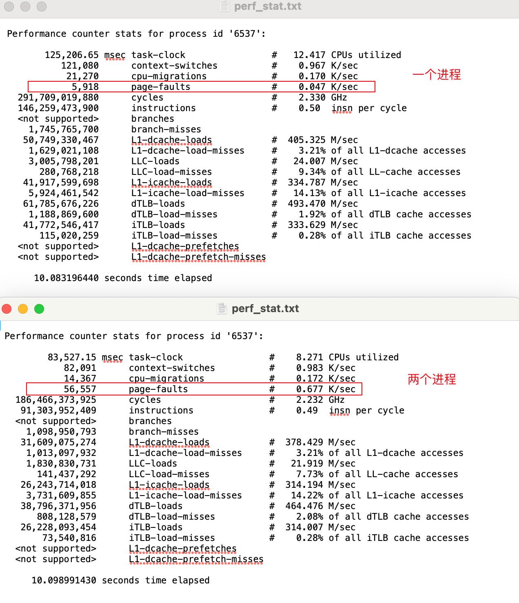
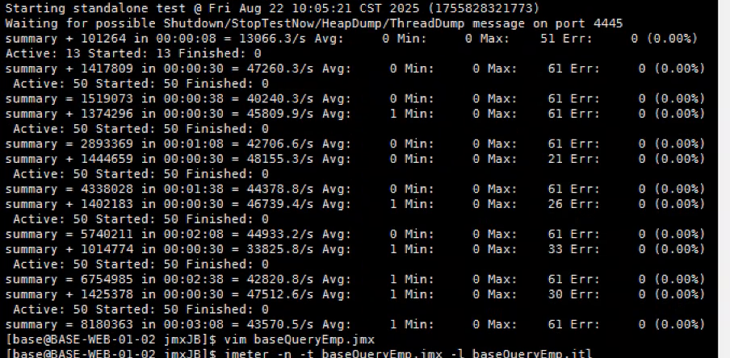
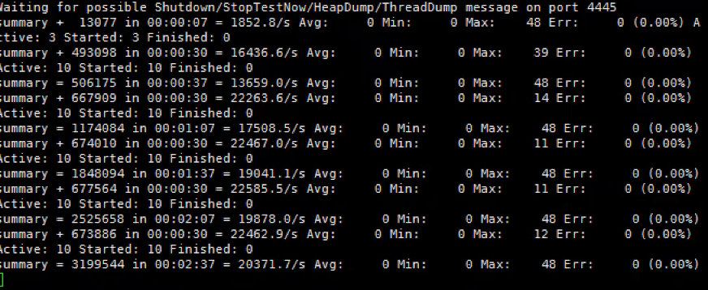
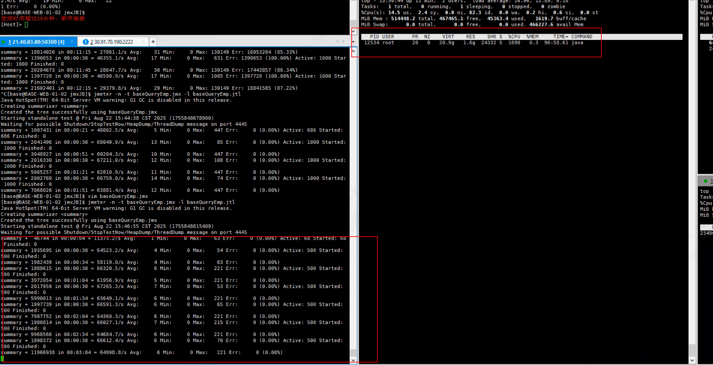
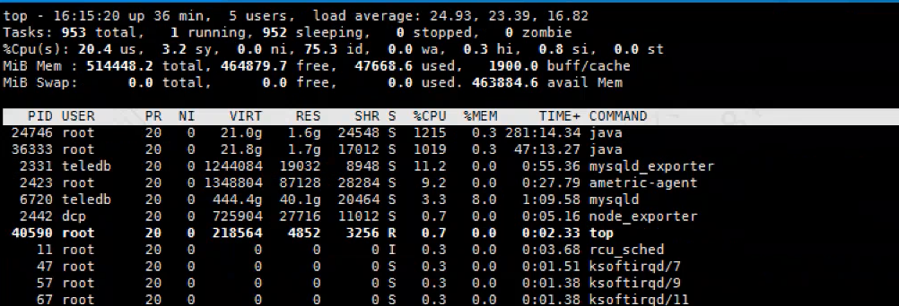
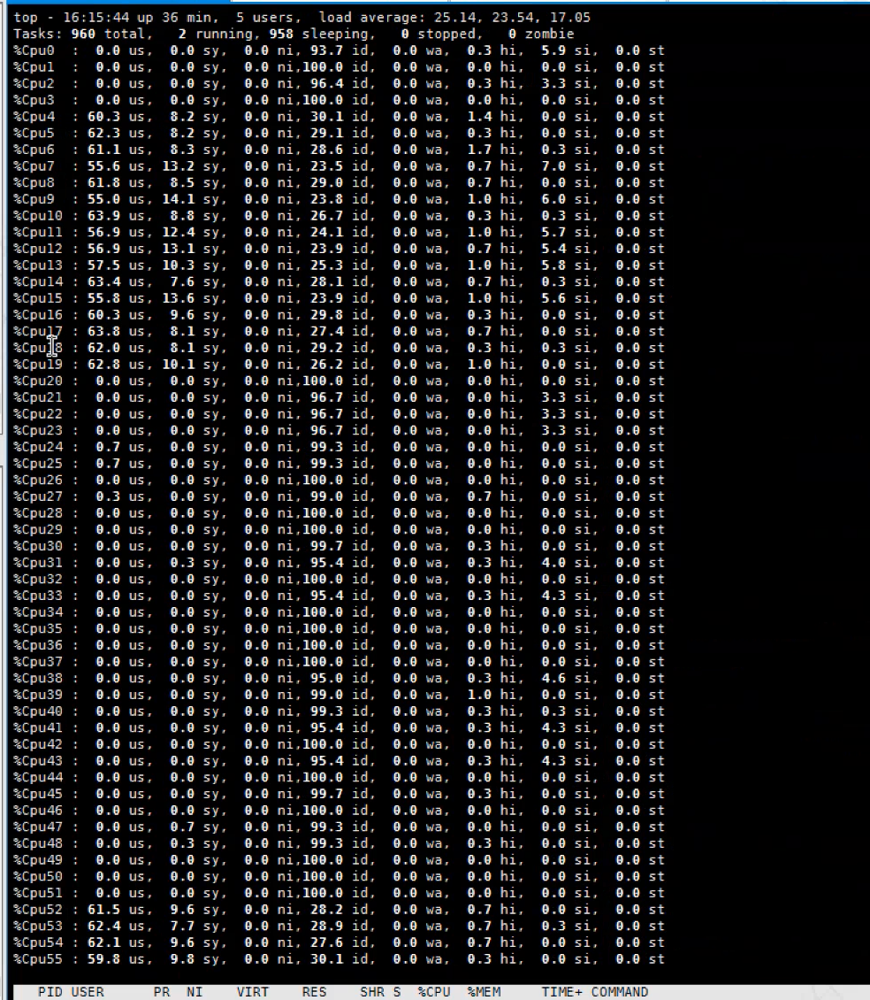

## 测试方法

一个jmeter压测机压测单业务节点，业务节点部署一个或两个java进程。单压业务侧节点，数据库直接返回200，不执行sql。

## 测试结果

### 单进程 500并发 openjdk

一个进程压测500并发，java进程可以用18个核左右

### 起两个进程 同时压500并发

两个进程cpu使用率加起来也是在18个核左右

Wake_up_common_lock 调用关系

### x86现网环境

1. x86是在现网环境（物理机）进行测试，并选择凌晨12:00之后进行压测。 这个凌晨的时间点，cpu使用率基本在2-3%左右，几乎没有使用【现网inter cpu负载的峰值有两个 15%， 还有一个28%】。压测过程，整机CPU使用率都较高在65.5%（500并发）-74.8%（2*500并发），可以这么说测试的业务进程几乎占用了x86所有的cpu。

## 现象描述

1. Cpu、网络磁盘io、热点函数未观察到瓶颈
2. 先起一个A进程压500并发，cpu用了18个核，网络IO在18MB/s； 此时再起一个B进程压500并发，A进程使用的CPU会下降到10个核，B进程则上升到8个核，网络IO在20MB/s。 
3. **尝试java进程绑核**：如果只起一个A进程，绑核绑在32核虚拟机的前16个核心，压测500并发，此时cpu也只使用8个核心。不绑核的话会使用18-20个核心。
4. 排除jmeter测试机瓶颈和网络瓶颈：将压测两个进程的jmeter脚本分别放在不同的测试机上，测试结果一致；且iperf网络测试带宽在3GB/s, 远超测试时候的20MB/s。
5. 排除数据库连接数瓶颈： 增加数据库连接数从4->16，测试结果不变
6. 山西电信CRM的tomcat 的maxThreads和maxConnects是默认配置，没有修改； 配置更大的值后，性能无明显提升。

## 火焰图

收集的java进程冷热火焰图: bash collect.sh -t 10 -p [其中一个java进程的pid]

热火焰图没有区别

冷火焰图有区别:  查询两个进程同时压测时的A进程的冷火焰图，能看到有另一个B进程的http-nio线程。NioBlockSele线程会将http请求分发给不同的http_nio线程进行处理。按理说不同进程的http_nio线程应该互不影响，但是这个冷火焰图有另一个进程的http_nio线程处理。

## perf stat 页错误增加10倍

## pidstat 

内核态cpu使用增加较多，一个进程5.4C， 两个进程大概是4.3 * 2 = 8.6C

 

http-nio线程集中在其中的两个线程

## GC 

## 连接数正常

## 裸机物理核

500并发的情况

1000并发的情况

虚机上没有进行压测：

## 单进程虚拟机100-500并发压测

| 并发数 | 时延 | tps     | 虚拟机CPU使用率 | 物理机 |
| ------ | ---- | ------- | --------------- | ------ |
| 10     | 0    | 20371.7 | 26%             |        |
| 50     | 1    | 43570.5 | 49%             |        |
| 100    | 1    | 47937.1 | 52.8%           | 70-73% |
| 300    | 5    | 50548.9 | 50.3%           |        |
| 500    | 9    | 49077   | 49.3%           |        |

50并发。cpu16核心。 使用率49%

10 并         8个核     使用率26

## 物理机部署业务性能

查下裸机的BIOS配置

### 32核： 

500并发

绑定4-35

绑定：4-19，52-67

2*500并发

绑定：4-19，52-67

### 40核

### 不绑核

