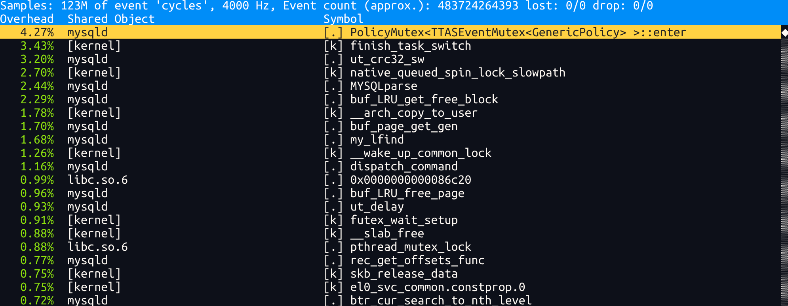
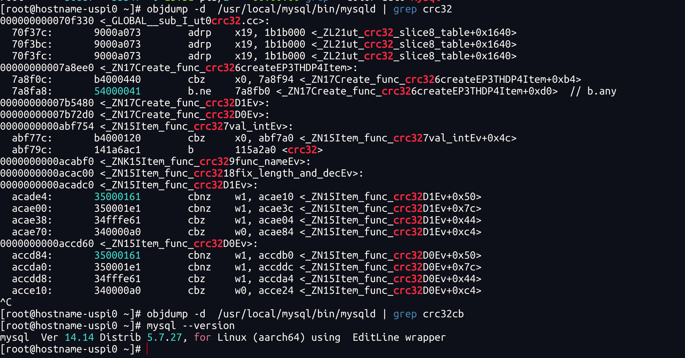
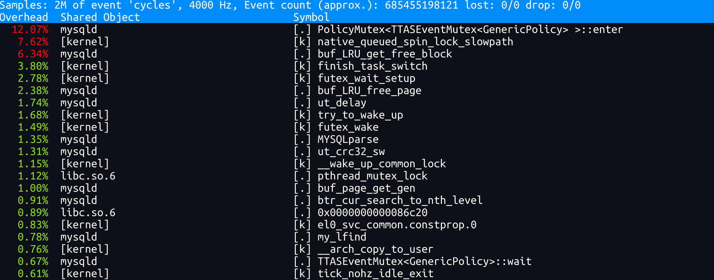
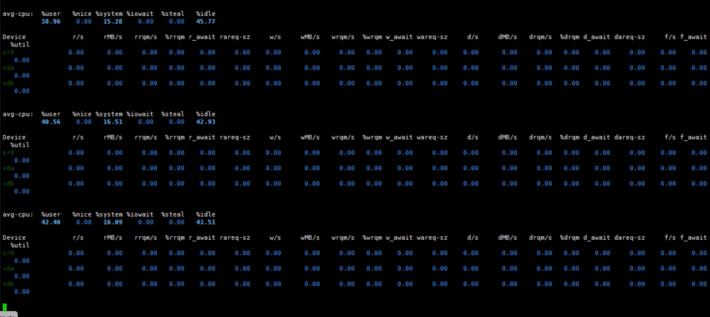
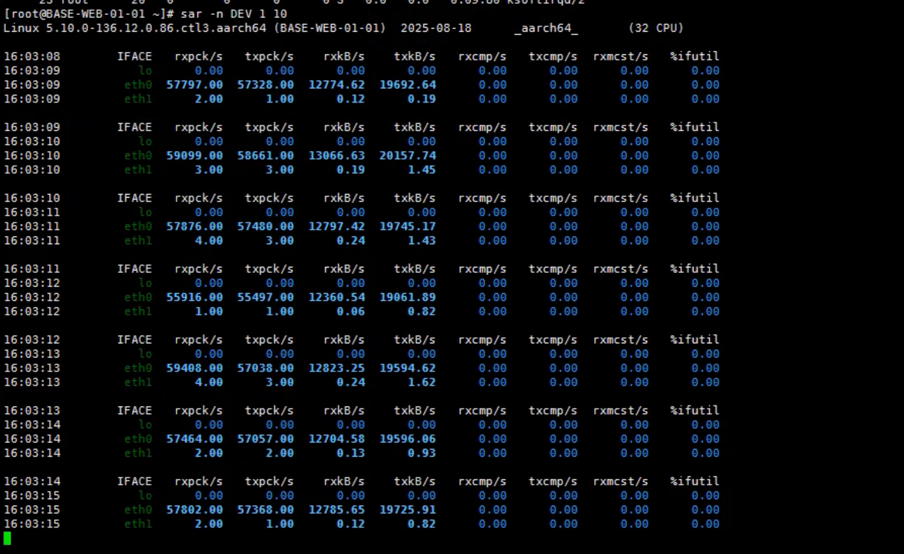
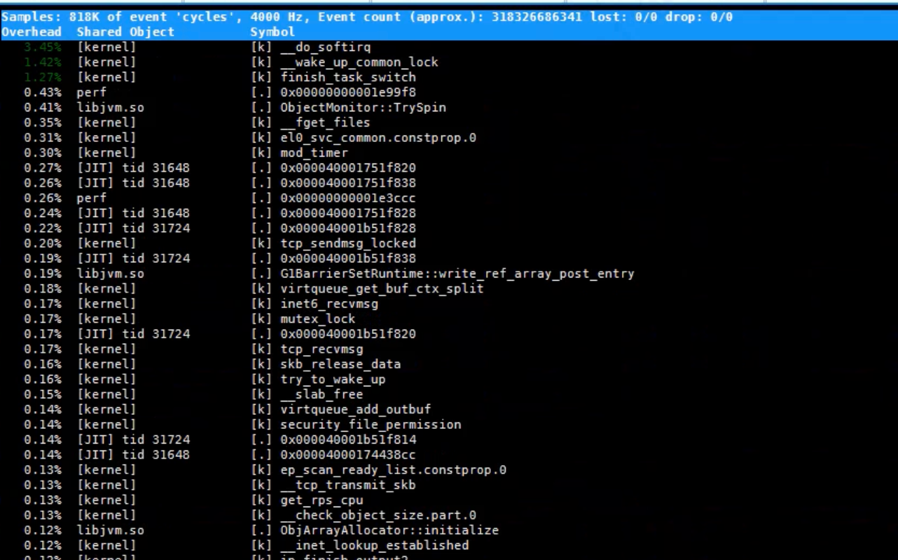
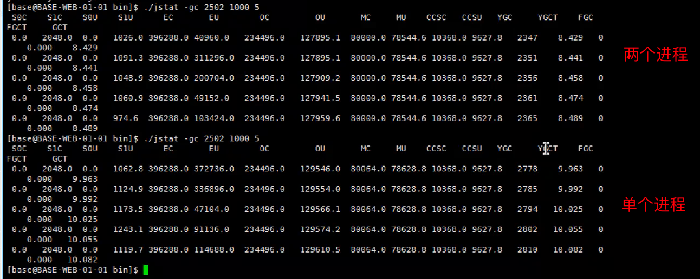

## mysql 5.7.27版本

sysbench安装测试：https://www.hikunpeng.com/document/detail/zh/kunpengdbs/testguide/tstg/kunpengsysbench_02_0007.html

mysql编译运行： https://www.hikunpeng.com/document/detail/zh/kunpengdbs/ecosystemEnable/MySQL/kunpengmysql8017_03_0013.html

- 175.11.22.3 压测 175.11.22.5 mysql机器，ut_crc32_sw热点函数存在且相对sysbench和mysql均配置在同一台机器上更高。大概率是ut_crc32_sw是与网络收发报校验有关导致的。

- sysbench和mysql均配置在同一台175.11.22.5 机器上

配置CRC32: https://github.com/mysql/mysql-server/pull/136/files

测试数据： https://docs.qq.com/sheet/DTnhwVE5FeHVRTUdv?tab=7uwyqn

单进程 500并发 openjdk

两进程 500并发 jdk fusion

