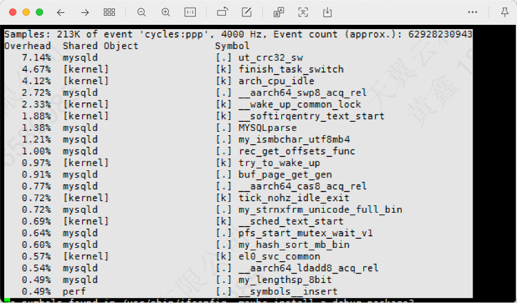

## 环境配置

|        | 现网环境：X86 裸机        | 鲲鹏环境：裸机      | 鲲鹏环境：虚拟机    |
| ------ | ------------------------- | ------------------- | ------------------- |
| CPU    | Intel E5-2630 v4 @2.20GHz | 2*5250 96core       | 2*7260 128core      |
| 内存   | 256G                      |                     |                     |
| 磁盘   |                           |                     |                     |
| 网卡   |                           |                     |                     |
| OS     | CentOS（待确认）          | CTYunOS 3           | CTYunOS 3           |
| 数据库 |                           | TeleDB 5.7.54-251.4 | TeleDB 5.7.54-251.4 |

## 测试组网

- X86业务进程及数据库均搭建在裸金属环境上进行测试，鲲鹏的压测方案则包含虚拟机和裸金属两种情况

## 测试结果

### X86整机（裸机）测试结果

####  空服务场景（未压测数据库）

| 场景         | qemu进程cpu使用率 | java进程cpu使用率 | 500并发延迟（ms） | 500并发吞吐量（每秒） |
| ------------ | ----------------- | ----------------- | ----------------- | --------------------- |
| 单个java进程 | -                 | 2620%             | 7                 | 43440.2/s             |
| 两个java进程 | -                 | -                 | 9                 | 64690.9/s             |

#### 业务+数据库场景

| 场景         | qemu进程cpu使用率 | java进程cpu使用率 | 500并发延迟（ms）          | 500并发吞吐量（每秒） |
| ------------ | ----------------- | ----------------- | -------------------------- | --------------------- |
| 单个java进程 | -                 | -                 | 45                         | 10325.8/s             |
| 两个java进程 | -                 | -                 | 31（压测数据可能存在问题） | 30433.8/s             |

### 1. 空服务场景（未压测数据库）

#### 1.1  鲲鹏32核虚拟机场景

| 场景         | qemu进程cpu使用率 | java进程cpu使用率 | 500并发延迟（ms） | 500并发吞吐量（每秒） | 时延相对x86整机（裸机） | 吞吐量相对x86整机（裸机） |
| ------------ | ----------------- | ----------------- | ----------------- | --------------------- | ----------------------- | ------------------------- |
| 单个java进程 | 2420%             | 1738%             | 9                 | 50429                 | -28.57%（慢2ms）        | +16.09%（+6988.8/s）      |
| 两个java进程 | 2676%             | 1900%             | 15～16            | 58878.8               | -72.22%（慢7.7ms）      | -8.98%（-5812.1/s）       |

#### 1.2 鲲鹏绑定32核（裸机7260）业务

| 场景                               | qemu进程cpu使用率 | java进程cpu使用率 | 500并发延迟（ms） | 500并发吞吐量（每秒） | 时延相对x86整机（裸机） | 吞吐量相对x86整机（裸机） | 备注     |
| ---------------------------------- | ----------------- | ----------------- | ----------------- | --------------------- | ----------------------- | ------------------------- | -------- |
| 单个java进程                       | -                 | 1851%             | 5                 | 70158.6/s             | +28.57%                 | +61.51%                   | ctyunos2 |
| 两个java进程（绑定同一个32核）     | -                 | 2240%             | 11-13             | 77891.2/s             | -27.78%                 | +20.41%                   | ctyunos2 |
| 两个java进程（绑定不同的32个核心） | -                 | 1892%和1555%      | 3                 | 69079.3/s和54780.7/s  | +66.67%                 | +91.46%                   | ctyunos2 |

#### 1.3 鲲鹏整机（裸机7260）业务

| 场景         | qemu进程cpu使用率 | java进程cpu使用率 | 500并发延迟（ms） | 500并发吞吐量（每秒） | 时延相对x86整机（裸机） | 吞吐量相对x86整机（裸机） |
| ------------ | ----------------- | ----------------- | ----------------- | --------------------- | ----------------------- | ------------------------- |
| 单个java进程 | -                 | 1722%-2830%       | 1                 | 72238.6/s             | +85.71%（快6ms）        | +66.29%                   |
| 两个java进程 | -                 | 4035%             | 1-2               | 119888.7              | +83.33%（快7.5ms）      | +85.33%                   |

### 2. 业务+数据库场景

#### 2.1 鲲鹏32核虚拟机业务+ 鲲鹏32核虚拟机数据库

| 场景         | qemu进程cpu使用率 | java进程cpu使用率 | 500并发延迟（ms） | 500并发吞吐量（每秒） | 时延相对x86整机（裸机） | 吞吐量相对x86整机（裸机） | 备注     |
| ------------ | ----------------- | ----------------- | ----------------- | --------------------- | ----------------------- | ------------------------- | -------- |
| 单个java进程 |                   |                   | 87                | 5330.2                | -93.33%（慢42ms）       | -48.38%（-4995.6/s）      |          |
| 两个java进程 | 3108%             | 1960%             | 117-118           | 4014.7/s和4074.5/s    | -279%                   | -73.42%                   | ctyunos2 |

> [!TIP]
>
> 裸机数据库场景建议做绑核操作，可以根据负载情况绑定一个numa或者一个socket

#### 2.2 鲲鹏32核虚拟机业务+ 鲲鹏整机（裸机5250）数据库

| 场景         | qemu进程cpu使用率 | java进程cpu使用率 | 500并发延迟（ms） | 500并发吞吐量（每秒） | 时延相对x86整机（裸机） | 吞吐量相对x86整机（裸机） | 备注     |
| ------------ | ----------------- | ----------------- | ----------------- | --------------------- | ----------------------- | ------------------------- | -------- |
| 单个java进程 | 3053%             | 2285%             | 54                | 9063.3                | -20.00%（慢9ms）        | -12.23%（-1262.5/s）      |          |
| 两个java进程 |                   |                   | 116和120          | 4017.9和3868.6        | -280.65%                | -74.09%                   | ctyunos2 |

#### 2.3 鲲鹏整机绑32核（裸机5250）业务+鲲鹏整机（裸机5250）数据库

| 场景                              | qemu进程cpu使用率 | java进程cpu使用率 | 500并发延迟（ms） | 500并发吞吐量（每秒） | 时延相对x86整机（裸机） | 吞吐量相对x86整机（裸机） | 备注     |
| --------------------------------- | ----------------- | ----------------- | ----------------- | --------------------- | ----------------------- | ------------------------- | -------- |
| 单个java进程（绑定4-19，52-67）   | -                 | 2048%             | 46                | 10384.4/s             | -2.22%                  | +0.57%                    | ctyunos2 |
| 两个java进程（均绑定4-19，52-67） | -                 | 1996%             | 104-106           | 9024.2/s              | -238.71%                | -70.35%                   | ctyunos2 |
| 两个java进程分开绑4-19核和52-67核 | -                 | 1326%和1217%      | 71和73            | 6932.8/s和6722.1/s    | -132.26%                | -55.13%                   | ctyunos2 |

## 测试结论

1. **空服务场景**：

   - **32核虚拟机部署环境中**，单进程场景的鲲鹏性能基本持平X86裸机场景，时延相对X86差28.57%（慢2ms），吞吐量相对X86好16.09%（+6988.8/s）。两进程场景的鲲鹏性能相对X86裸机性能较差，时延相对X86差72.22%（慢7.7ms），吞吐量相对X86差8.98%（-5812.1/s）。
   - **鲲鹏物理机仅使用物理核32核环境中**，单进程场景，鲲鹏时延相对x86好28.57%，吞吐量相对x86好61.51%；两进程场景时延落后x86 27.28%，吞吐量比x86高20.41%。
   - **鲲鹏服务器整机场景下**，CPU资源充足，在单进程和两进程场景下，时延和吞吐量都明显高于x86整机性能。
   - 分析发现，虚拟机场景下单进程500并发场景下鲲鹏32核虚拟机对应的物理核心（其中的32核物理核）负载过高，在75-85%，导致增加到两进程各500并发场景后，物理CPU负载更高，时延增加较多的问题。CPU负载中存在一部分虚拟化引入的负载，虚拟机内部进程CPU负载在60%左右，所以额外的15-25%的负载猜测是虚拟化带来的消耗。

   **业务+数据库场景**：(数据库场景剩余优化空间：数据库进程绑核 + CRC32优化)

   - **32核虚拟机部署业务+ 32核虚拟机部署数据库**：单进程和两进程场景鲲鹏性能相对X86裸机性能均较差，单进程中时延较x86差93.33%（慢42ms），吞吐量较x86差48.38%（-4995.6/s）；两进程场景时延和吞吐分别差279% 和73.42%。
   - **32核虚拟机部署业务+ 整机部署数据库：** 单进程场景中，鲲鹏性能相较x86差距较小，鲲鹏相较x86整机场景，时延和吞吐分别差20%（慢9ms） 和12.23%（-1262.5/s）；多进程场景未测试，待补充。

2. X86现网环境业务侧部署7-8个业务进程，查询一天的现网CPU负载的峰值在28%左右（夜间1-2%），现网环境夜间进行单进程500并发压测时，CPU负载在65.5%左右。粗略计算现网真实的业务负载在213/7=30.53并发左右，所以现网500并发场景应该是达不到的。

## 调优方案

### 业务侧

| 调优措施                               | 虚拟化场景 | 裸机场景 |
| -------------------------------------- | ---------- | -------- |
| 毕昇融合JDK8                           | 支持       | 支持     |
| JVM透明大页                            | 支持       | 支持     |
| tuned profile修改为network-throughtput | 支持       | 支持     |
| 虚拟机拓扑调整                         | 支持       | 不支持   |

### 数据库侧

| 调优措施                  | 虚拟化场景                       | 裸机场景 |
| ------------------------- | -------------------------------- | -------- |
| 虚拟机拓扑调整            | 支持                             | 不支持   |
| 网卡中断绑核，绑定4个核心 | 支持                             | 未测试   |
| CRC32 （待验证）          | 支持                             | 支持     |
| 数据库进程绑核（待验证）  | 一般虚机绑核就行，不需要进程绑核 | 支持     |

CRC32优化原因：业务性能测试过程中发现ut_crc32_sw热点函数，可通过CRC32优化将软件实现修改为硬件实现，提升teledb性能。

### 调优效果

| 优化措施\单进程32核虚拟机场景（空服务） | 详细配置 | 时延ms | 性能提升 | 吞吐量/s | 性能提升 |
| --------------------------------------- | ---- | ------ | -------- | -------- | -------- |
| 基线性能                                | - | 14     | -        | 28243.4  | -        |
| 毕昇融合JDK8                            | 1. 下载毕昇JDK融合版本：https://www.hikunpeng.com/zh/developer/devkit/download/jdk  2. 拷贝压缩包至服务器后解压 3. 配置JAVA环境变量 | 13     | 7.14%    | 35180    | 24.56%   |
| JVM参数-XX:+UseTransparentHugePages     | 应用程序启动时添加JVM参数XX:+UseTransparentHugePages | 12     | 7.69%    | 37225    | 5.81%    |
| tuned profile修改为network-throughput  | 配置tuned-adm profile network-throughput后重启服务器，重启后再次执行tuned-adm profile network-throughput | 11     | 8.33%    | 39467    | 6.02%    |
| 虚拟机拓扑调整                          | 修改天翼云平台配置文件（后续天翼云平台会改进，使其成为默认配置） |9      | 18.18%   | 49739.4  | 26.03%   |

| 优化措施\单进程32核虚拟机业务+32核虚拟机数据库 | 详细配置 |时延ms | 性能提升 | 吞吐量/s | 性能提升 |
| ---------------------------------------------- | ---- | ------ | -------- | -------- | -------- |
| 基线（虚拟机拓扑调整）                         | 修改天翼云平台配置文件（后续天翼云平台会改进，使其成为默认配置） | 91     | -        | 5170.2   | -        |
| 网卡中断绑核，绑定4个核心                      | bash bind_net_irq.sh -d enpXXX -l 4 -c 0-3 | 81     | 10.99%   | 5330.2   | 3.09%    |

## 后续计划

待思特奇确认性能是否满足，以及确定后续现网使用虚机还是裸机，再投入调优。

## 附录

[测试数据](https://docs.qq.com/doc/DWWdORkd2R2V0TXpj)

[测试数据整理（部分）](https://docs.qq.com/sheet/DTnhwVE5FeHVRTUdv?tab=7uwyqn)

【腾讯文档】山西IT上云测试数据 https://docs.qq.com/sheet/DWWVhaFdEUWxJWkFZ?tab=BB08J2
