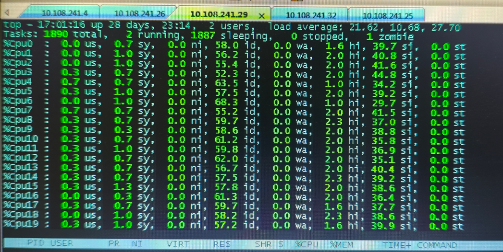
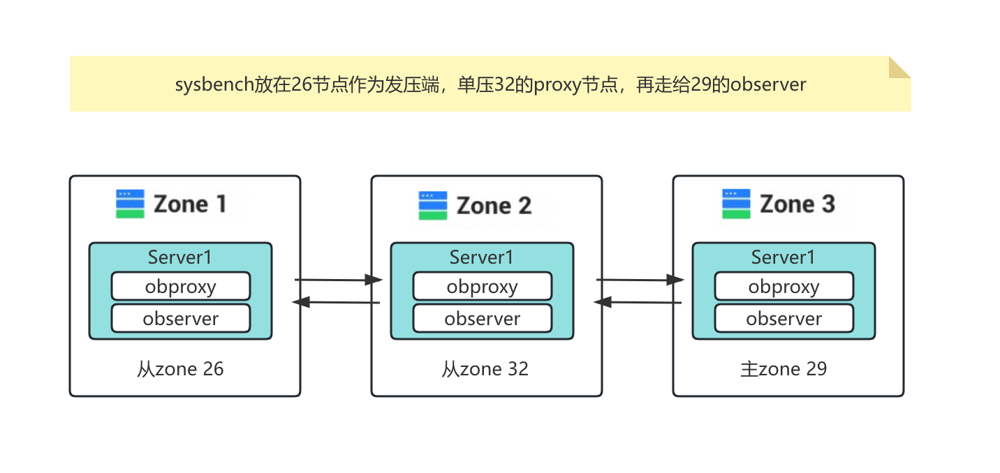
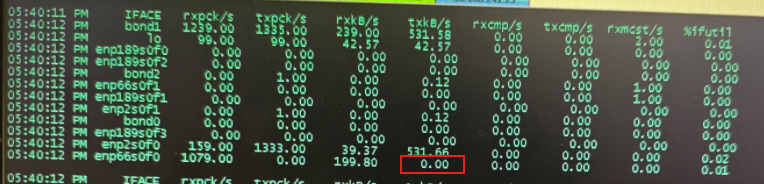
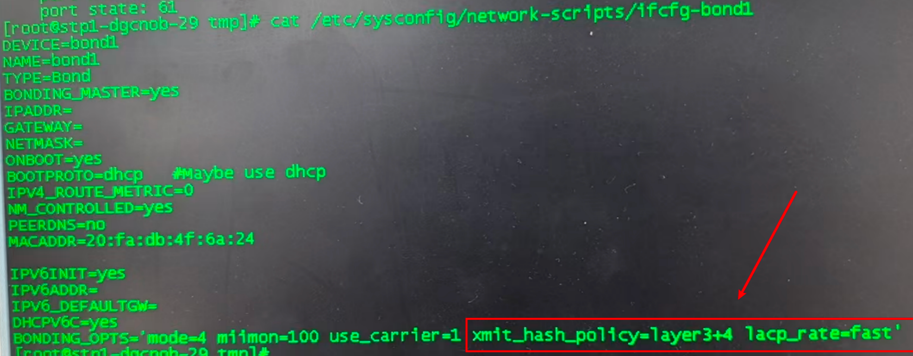
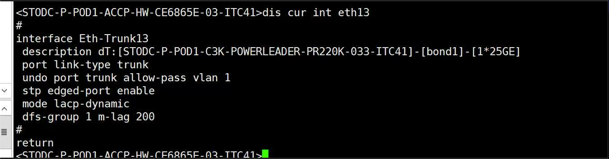
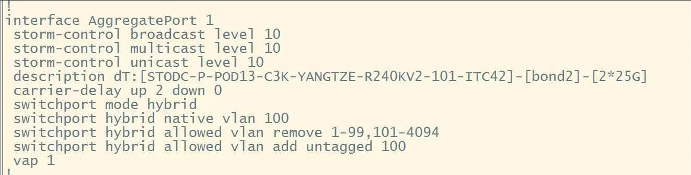

## 问题描述

东莞区POD1 的OB主机（C3K）存在网卡中断占用过高的问题，相比POD13机器，软中断消耗增加了44%，TPS/QPS性能下降38%

- POD13正常节点

  

- POD1异常节点

  

  

## 测试场景



## 环境配置

| 配置         | POD13_240 （正常节点）                         | POD1_29（异常节点）                            | POD1_29 升级后的版本  |
| ------------ | ---------------------------------------------- | ---------------------------------------------- | --------------------- |
| OS           | BCLinux 21.10U3 LTS（4.19.90-2107.6.0.0192.8） | BCLinux 21.10U3 LTS（4.19.90-2107.6.0.0192.8） |                       |
| CPU          | 4 * 5250                                       | 4 * 5250                                       |                       |
| 网卡         | **SP681 2*25GE**                               | Mellanox MT27710 CX4                           |                       |
| 网卡驱动版本 | hinic3 17.6.9.2                                | **mlx5_core 5.0-0**                            | mlx5_core 24.10-3.2.5 |
| 网卡固件版本 | 15.19.2.10                                     | 14.31.1014                                     | 14.32.1010            |
| 交换机       | 锐捷                                           | CE6881                                         |                       |
| 主机厂商     |                                                | 宝德 PR220K                                    |                       |
| OB版本       | 4.2.1.11                                       | 3.2.4.5                                        |                       |

## 性能分析

### 1.环境对比

#### 1.1.BIOS默认配置查询


#### 1.2 OS参数配置

```shell
# 比较POD1和POD13的tcp和ipv4相关参数，未发现明显差异点
sysctl -a | grep tcp
sysctl -a | grep ipv4

[root@hostname-aryvb ~]# sysctl -a | grep tcp_tw
net.ipv4.tcp_tw_reuse = 2
[root@hostname-aryvb ~]# sysctl -a | grep ip_local 
net.ipv4.ip_local_port_range = 32768    60999
```

#### 1.3 软中断情况

相比POD13机器，POD1 软中断消耗增加了44%的原因主要是因为POD1 中断绑核只绑在numa0上，但是POD13的机器绑在两张网卡所在的两个numa上 （numa0 和numa6），该差异点对性能影响较小，OB反馈的软中断问题导致的性能劣化这个结论不成立。

#### 1.4 bond4检查

bond4 存在流量不均匀的情况，发的流量几乎集中在enp2s0f0



### 2. 流量不均匀问题排查

#### 2.1 bond4配置差异

vim /etc/sysconfig/network-scripts/ifcfg-bond1

查询到bond组hash策略未配置，默认为layer2， POD13为xmit_hash_policy=layer3+4。后续调整bond4 hash策略为layer3+4 的场景。


具体修改如下所示：（lacp_rate=fast 因为汕头区域OB集群也配置了，所以增加了该配置）


修改后重启bond4

```shell
# 重启bond4 需要执行以下两条命令 【注意nmcli的命令最好放到sh脚本中执行，避免ssh无法正常连接】
systemctl restart NetworkManager # 这个不生效，实际环境可以两个命令都试试，看看哪个能生效
nmcli c down bond1 && nmcli c up bond1   # 这个生效
```

cat /proc/net/bonding/bond1 查看配置是否生效


layer3+4 hash策略修改后，流量会均匀一段时间，但是后续又会慢慢变到不均匀的状态，从10MB的差异一直劣化到300MB，且持续波动。sysbench性能从55.3W下降到30W。流量不均匀的状态有时候只在proxy节点的发端，有时候是sysbench测试的整个流程收发端都不均匀。


#### 2.2 交换机配置查询

交换机的ipv4 和 ipv6 hash策略均为IP+port ， 配置是正常的。且**交换机运维的人员反馈，tx端不均匀问题和交换机是没有关系的**，所以主要还是在主机侧进行排查。

- pod1

  

  

  

  bond4对应的交换机口的配置信息

  

- pod13

  

  bond4对应的交换机口的配置信息

  

#### 2.3 其它测试排查手段

```shell 
netstat -antp | grep 2883   # 排查是否IP和端口不同
iperf3 # 性能测试流量也不均匀
iftop -P -B -i bond1    # 查看tcp连接情况
# IO模组位置查询，未排查，需要在BMC上查看
ip -s link show bond1 # 查看丢包情况，pod1有mcast，pod13没有
# 多发压段共同压测sysbench，流量还是不均匀的状态
```

#### 2.4 固件&驱动版本

豆包查询14.31.1014的结果

1. **同系列网卡旧固件普遍存在 RSS 哈希缺陷**：Mellanox ConnectX - 4 Lx 系列网卡（如 MCX4121A - ACUT）的旧版固件，曾被曝出有 DMA 映射与 RSS 相关缺陷。而 RSS 技术正是负责将网络流量通过哈希算法分发到不同队列和网卡，其缺陷会直接导致流量哈希分布异常。14.31.1014 属于该系列网卡的较早固件版本，大概率受这类共性缺陷影响。
2. **低版本固件易与驱动协同异常加剧不均**：Mellanox 网卡的 hash 分发依赖固件与驱动的协同工作。14.31.1014 搭配旧版 mlx5 驱动时，可能出现哈希算法执行偏差。而升级到 14.32.1010 这类更新版本后，固件会修复驱动适配漏洞，同时优化哈希计算的稳定性，不少用户反馈升级后 bond4 网卡的流量分布波动明显减小。
3. **同类场景中固件升级验证有效**：在 Mellanox CX6 等后续系列网卡中，低版本固件曾出现过 RSS hash 抖动问题，导致报文分发异常。这类问题通过升级固件、修复硬件层面的规则重置漏洞得以解决。14.31.1014 对应的 ConnectX - 4 Lx 系列，虽无 14.31.1014 版本 hash 不均的直接文档，但参考同品牌网卡的固件优化逻辑，升级操作对解决 hash 分布问题的适配性很高。

### 3. 升级固件和驱动

**固件升级至14.32.1010，驱动升级至mlx5_core 24.10-3.2.5版本后，重启服务器。**


​	POD1 C3K服务器mellanox网卡驱动与固件未升级前，bond4网卡流量不均匀，两张网卡流量差异在300MB内波动，当网卡流量差距达到300MB时，OB的sysbench性能从55.3W QPS下降到30W QPS，性能下降幅度为46%。升级网卡驱动和固件版本后，bond4网卡流量差异保持在30MB内波动，sysbench性能稳定在49W-56W区间，均值为53W，未出现OB数据库性能大幅下降的情况。


未升级固件驱动、未配置sql索引

