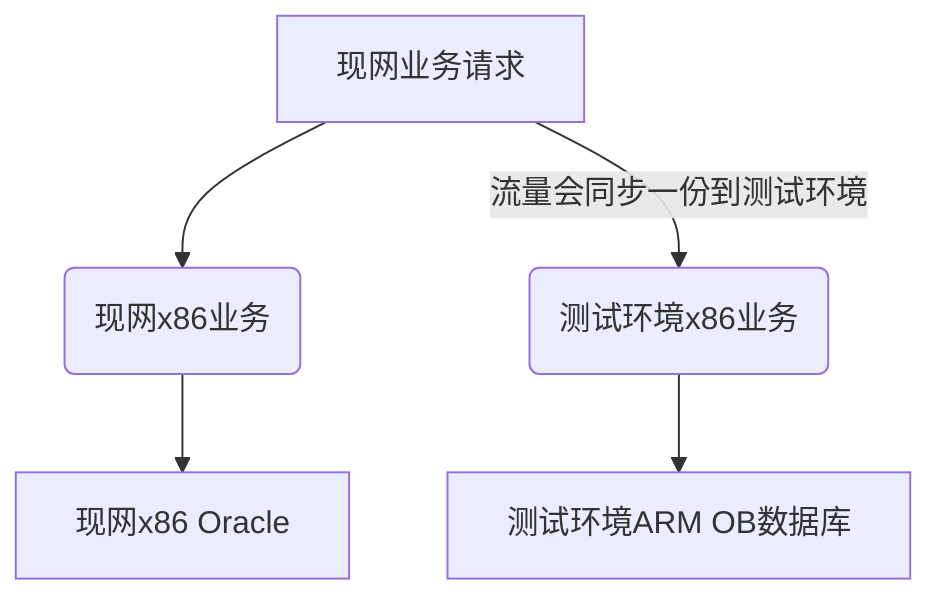

## 问题描述

​	OB数据库（arm）+ x86业务相比Oracle（x86） + x86业务 性能落后80%（端到端业务性能）。 计划9月23日割接上线。


## 组网图




## 性能优化

 	1. 9月2日，arm + ob性能（端到端业务性能）为Oracle（x86）的1.69倍，和8月底1.8倍的性能相差0.11。咨询悦涛具体的调优措施，悦涛反馈不清楚性能提升具体的原因。本人猜测可能是缓存问题，性能持续提升。
 	2. 副本数调大 （现网的1.3倍） +  熊杰 OB SQL优化， 当前性能是Oracle（x86）的1.51倍，
 	3. **cachePrepStmts=true** ： cachePrepStmts参数决定了 JDBC driver 是否缓存 Prepared 语句，搭配 ：prepStmtCacheSize 决定了可以缓存多少条 prepared statements，先配置为1000）
 	4. 

```shell
# 检测OS 内核是否配置该参数CONFIG_SCHED_STEAL=y
# 方式一：
[root@hostname-qkpmn home]# zcat /proc/config.gz | grep CONFIG_SCHED_STEAL
CONFIG_SCHED_STEAL=y
# 方式二：
[root@hostname-ispmp ~]# cat /boot/config-$(uname -r) | grep CONFIG_SCHED_STEAL
CONFIG_SCHED_STEAL=y

# vi /etc/default/grub 添加参数： sched_steal_node_limit=4
grub2-mkconfig -o /boot/efi/EFI/openEuler/grub.cfg
reboot


 echo STEAL >  /sys/kernel/debug/sched_features;
 echo 1 > /proc/sys/kernel/sched_schedstats
 
 
 echo NO_STEAL >  /sys/kernel/debug/sched_features;
 echo 0 > /proc/sys/kernel/sched_schedstats
```

