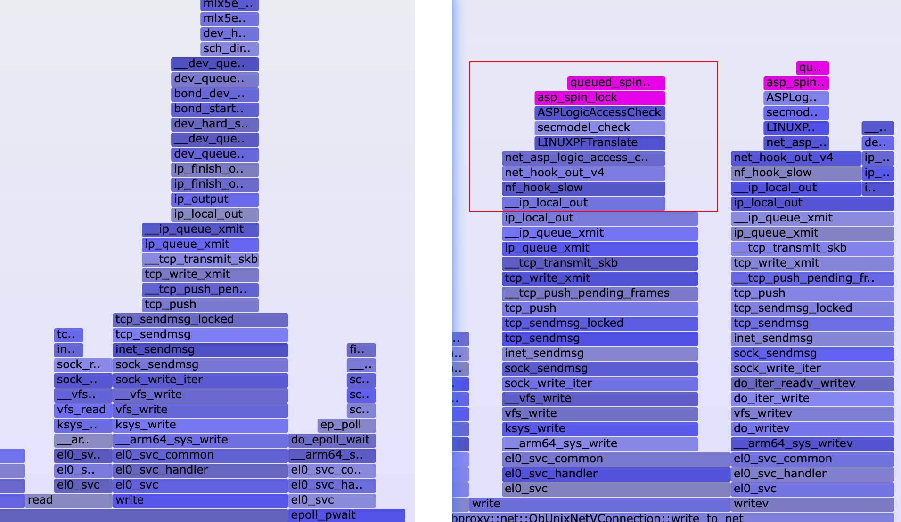

## 缺少的图片

1. sysbench压测脚本
2. 145的bios配置\ top命令显示cpu占比高的函数
3. 

## 测试场景

sysbench： 800并发/10W记录/256表

Pod13 有问题的场景： 241 连接240proxy压测 240和242的observer

佛山无问题的场景： 132 连接145proxy压测 145和XXX的observer

## 现象

### 240问题机器现象：

### 145佛山无问题节点

## 环境配置

|              | 240                                            | 226                  | 145                                            |      |
| ------------ | ---------------------------------------------- | -------------------- | ---------------------------------------------- | ---- |
| OS           | BCLinux 21.10U3 LTS（4.19.90-2107.6.0.0192.8） |                      | BCLinux 21.10U3 LTS（4.19.90-2107.6.0.0192.8） |      |
| CPU          | 4 * 7260                                       |                      |                                                |      |
| 网卡         | SP681 2*25GE                                   | Netswift RP1000P2SFP |                                                |      |
| 网卡驱动版本 | hinic3 17.6.9.2                                |                      | Mlx5_core 5.0-0                                |      |
| 网卡固件版本 | 15.19.2.10                                     |                      | 14.31.1014                                     |      |
| 中断         | 24个核心 几乎都100%                            |                      |                                                |      |
|              |                                                |                      |                                                |      |
|              |                                                |                      |                                                |      |
|              |                                                |                      |                                                |      |

## 定位

### BIOS配置比对

​	问题机器和佛山145的关键差异在于PxeRetry的配置，修改240、241、242三台设备的PxeRetry为1，并修改了240一台设备的PCIeSRIOVSupport为Enabled，均无变化

241 

246

### 网络参数对比

### perf top函数差异点

使用bash ./collect.sh -t 10 收集系统侧火焰图以及添加-p参数收集proxy进程火焰图，查看spin_lock的调用函数

异常节点240 ip_local_out函数调用了nf_hook_slow函数，去获取spin_lock锁了，不清楚阻塞在哪里？

