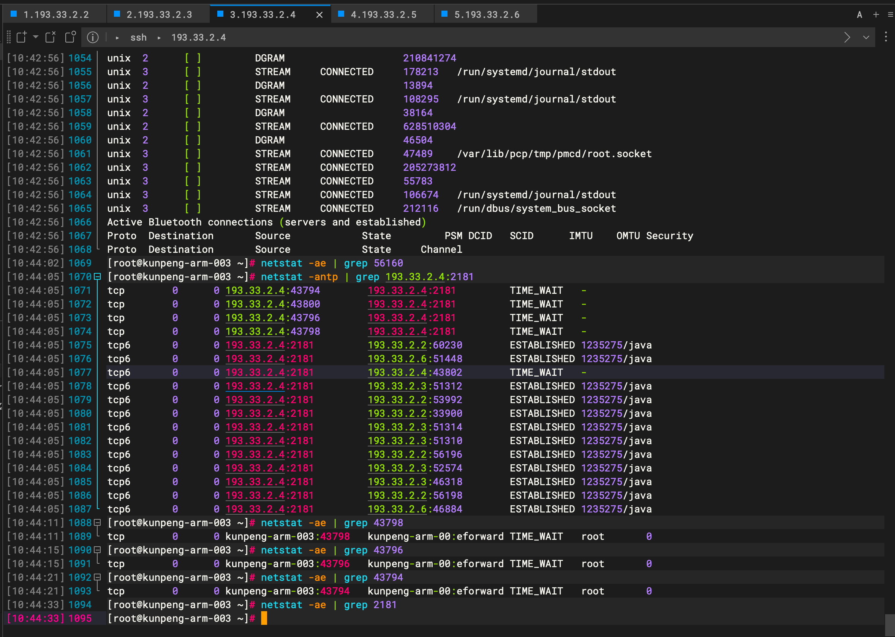
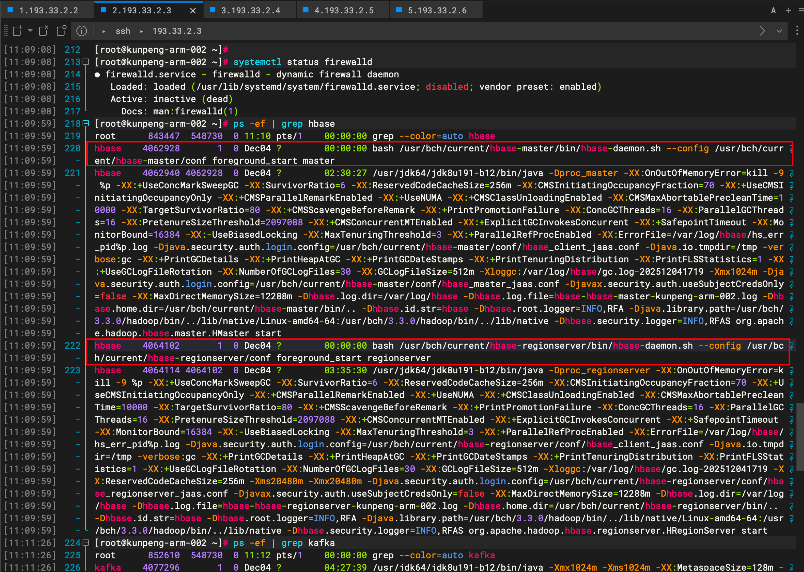
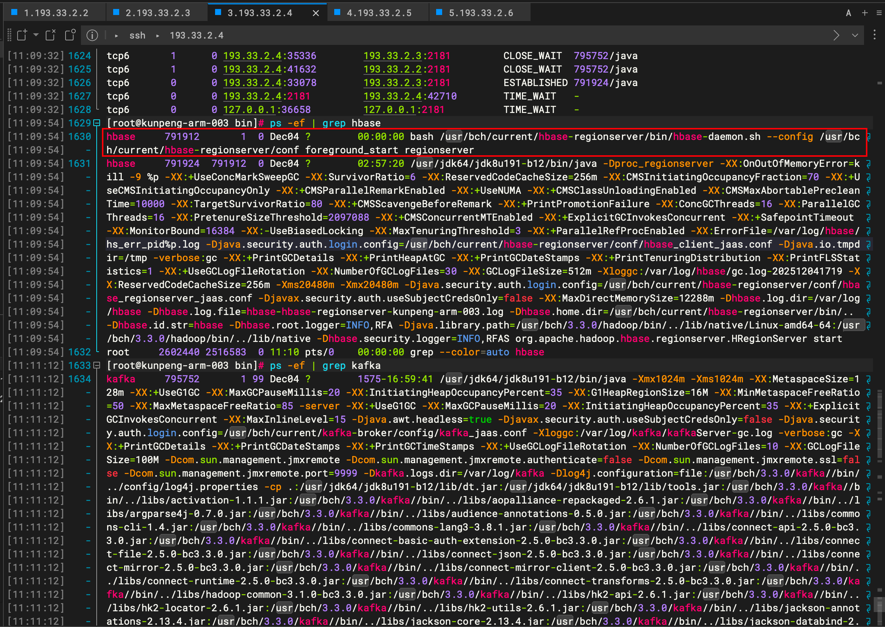
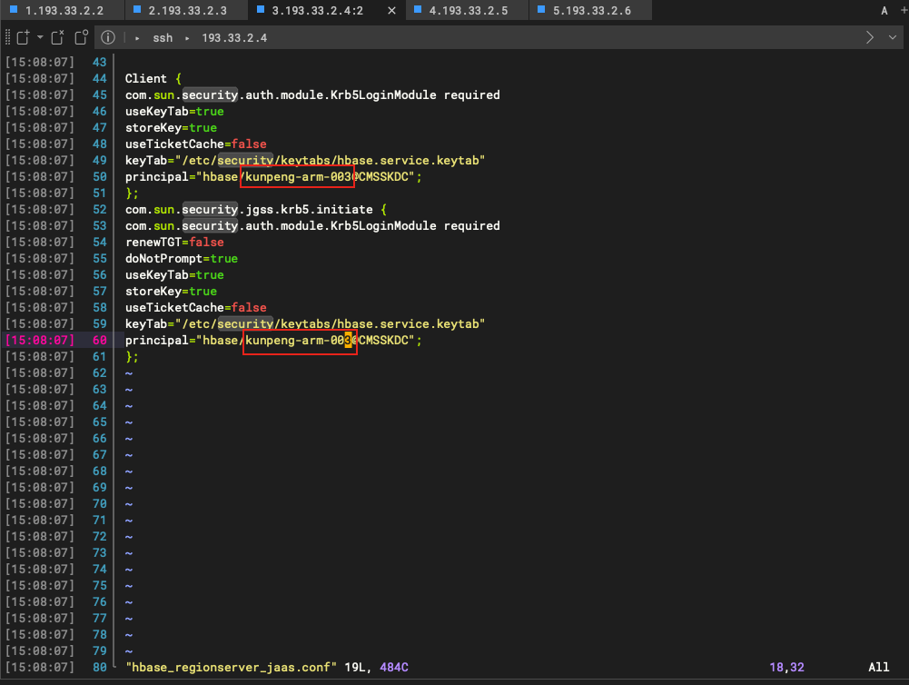
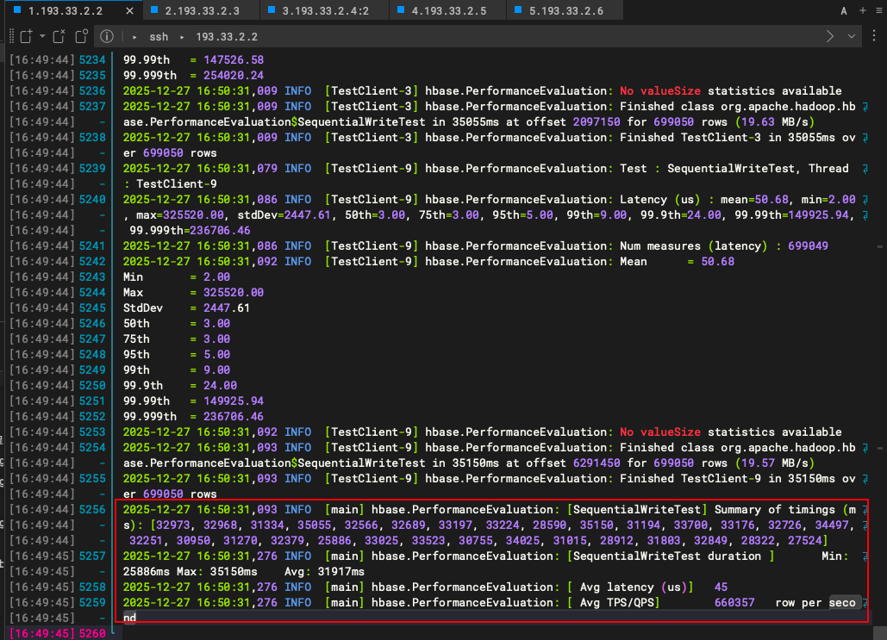
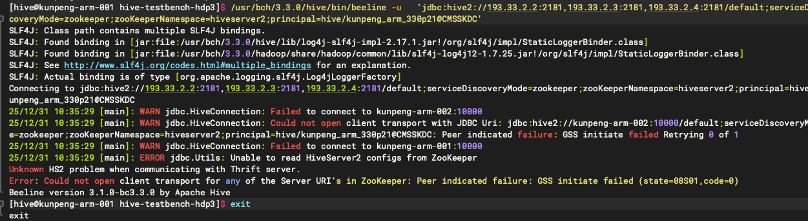
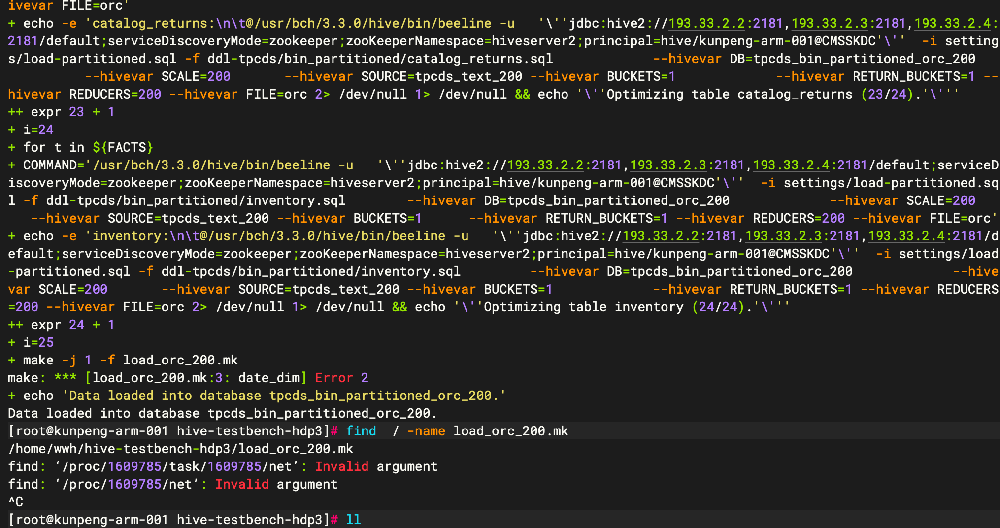
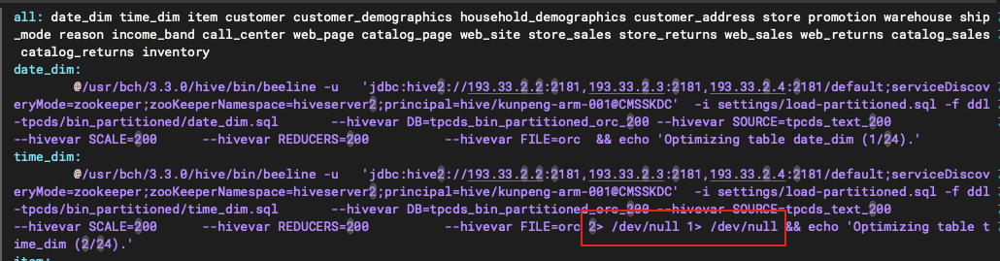
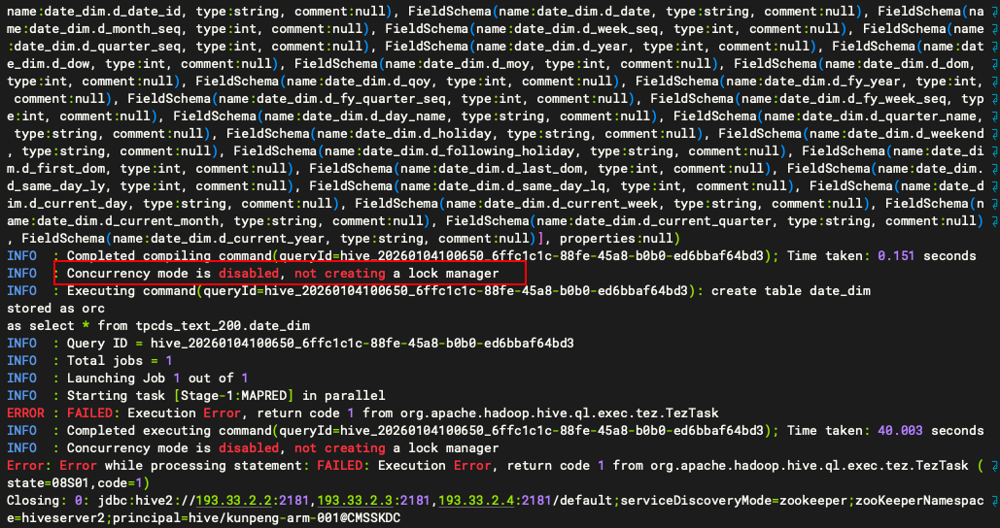
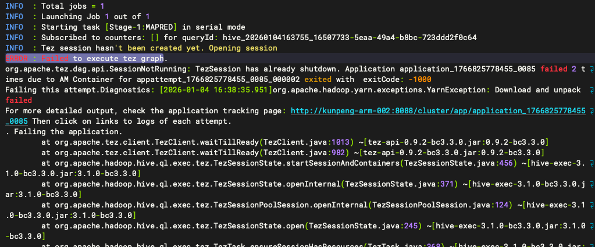

## 移动云hadoop测试


zk. : /usr/bch/3.3.0/zookeeper/bin/zkServer.sh


193.33.2.2 和193.33.2.3 zookeeper节点对kafka和hbase，但是193.33.2.4 zookeeper没有正确连接任何其他服务





hbase 缺少 master






缺少文件，从.3服务器拷贝了个文件到.4


```shell
  492  cd /usr/bch/current/hbase-regionserver/conf/
  493  ll
  494  chown -R hbase:root ./hbase_master_jaas.conf 
```


启动hbase依旧报错

/usr/bch/3.3.0/hbase/bin/hbase-daemon.sh start master

/var/log/hbase/hbase-hbase-master-kunpeng-arm-003.log


hbase_regionserver_jaas.conf配置文件003 错误配置成004导致master节点无法成功启动，修改后重启regionserver，再启动master成功




```shell
# 尝试一： 关闭.4上的zookeeper

su zookeeper
vim /usr/bch/3.3.0/zookeeper/conf/zoo.cfg
# 删除server.3=kunpeng-arm-003:2888:3888
/usr/bch/3.3.0/zookeeper/bin/zkServer.sh status
/usr/bch/3.3.0/zookeeper/bin/zkServer.sh restart 

/usr/bch/3.3.0/zookeeper/bin/zkServer.sh stop 


su hbase
vim /usr/bch/3.3.0/hbase/conf/hbase-site.xml
# 修改
    <property>
      <name>hbase.zookeeper.quorum</name>
      <value>kunpeng-arm-001,kunpeng-arm-002,kunpeng-arm-003</value>
    </property>
    
# 修改为

    <property>
      <name>hbase.zookeeper.quorum</name>
      <value>kunpeng-arm-001,kunpeng-arm-002</value>
    </property>
    
# 重启regionserver和master
/usr/bch/3.3.0/hbase/bin/hbase-daemon.sh restart master
/usr/bch/3.3.0/hbase/bin/hbase-daemon.sh restart regionserver

# 报错依旧存在 
2025-12-27 16:25:51,983 WARN  [ReadOnlyZKClient-kunpeng-arm-001:2181,kunpeng-arm-002:2181@0x295eaa7c-SendThread(kunpeng-arm-002:2181)] zookeeper.ClientCnxn: An exception was thrown while closing send thread for session 0x2009e58322c0025.
EndOfStreamException: Unable to read additional data from server sessionid 0x2009e58322c0025, likely server has closed socket
        at org.apache.zookeeper.ClientCnxnSocketNIO.doIO(ClientCnxnSocketNIO.java:77)
        at org.apache.zookeeper.ClientCnxnSocketNIO.doTransport(ClientCnxnSocketNIO.java:350)
        at org.apache.zookeeper.ClientCnxn$SendThread.run(ClientCnxn.java:1290)
        
        
# 尝试二： https://www.cnblogs.com/zhangmingcheng/p/12073818.html
具体问题所在：

客户端连接Zookeeper时，配置的超时时长过短。致使Zookeeper还没有读完Consumer的数据，连接就被Consumer断开了。

解决方案：

初始化Zookeeper连接时，将接收超时参数值调整大一些即可（tickTime2000改为10000），默认是毫秒（ms）


vim /usr/bch/3.3.0/zookeeper/conf/zoo.cfg
# tickTime=3000 修改为10000
/usr/bch/3.3.0/zookeeper/bin/zkServer.sh restart 
# 还是报相同的错误


# 继续修改tickTime 为50000
报错消失

```




## TPC-DS 工具




执行 bash -x tpcds-setup.sh 200  报错make: *** [load_orc_200.mk:3: date_dim] Error 2



vim load_orc_200.mk 

删除2> /dev/null 1> /dev/null 显示报错信息



INFO  : Concurrency mode is disabled, not creating a lock manager



vim settings/load-partitioned.sql 

增加一行 SET hive.support.concurrency=true;


vim /usr/bch/3.3.0/hive/conf/hive-site.xml 

    <property>
      <name>hive.support.concurrency</name>
      <value>true</value>
    </property>

重启hive

ps -ef | grep hive 

直接kill -9 hiveserver2 再 metastore

hive --service metastore &

hive --service hiveserver2 &

```shell
[hive@kunpeng-arm-001 hive]$ ps -ef | grep hive 
hive      827848       1  0  2025 ?        02:02:34 /usr/jdk64/jdk8u191-b12/bin/java -Dproc_jar -Xloggc:/var/log/hive/hivemetastore-gc-%t.log -XX:+UseG1GC -XX:+PrintGCDetails -XX:+PrintGCTimeStamps -XX:+PrintGCCause -XX:+UseGCLogFileRotation -XX:NumberOfGCLogFiles=10 -XX:GCLogFileSize=10M -XX:+HeapDumpOnOutOfMemoryError -XX:HeapDumpPath=/var/log/hive/hms_heapdump.hprof -Dhive.log.dir=/var/log/hive -Dhive.log.file=hivemetastore.log -Xmx1024m -Dproc_metastore -Xmx128788m -Dlog4j.configurationFile=hive-log4j2.properties -Djava.util.logging.config.file=/usr/bch/current/hive-metastore/conf//parquet-logging.properties -Dyarn.log.dir=/var/log/hadoop/hive -Dyarn.log.file=hadoop.log -Dyarn.home.dir=/usr/bch/3.3.0/hadoop -Dyarn.root.logger=INFO,console -Djava.library.path=:/usr/bch/3.3.0/hadoop/lib/native/Linux-aarch-64:/usr/bch/3.3.0/hadoop/lib/native -Dhadoop.log.dir=/var/log/hadoop/hive -Dhadoop.log.file=hadoop.log -Dhadoop.home.dir=/usr/bch/3.3.0/hadoop -Dhadoop.id.str=hive -Dhadoop.root.logger=INFO,console -Dhadoop.policy.file=hadoop-policy.xml -Dhadoop.security.logger=INFO,NullAppender org.apache.hadoop.util.RunJar /usr/bch/current/hive-client/lib/hive-metastore-3.1.0-bc3.3.0.jar org.apache.hadoop.hive.metastore.HiveMetaStore
hive     1037675       1  0  2025 ?        02:22:24 /usr/jdk64/jdk8u191-b12/bin/java -Dproc_jar -Xloggc:/var/log/hive/hiveserver2-gc-%t.log -XX:+UseG1GC -XX:+PrintGCDetails -XX:+PrintGCTimeStamps -XX:+PrintGCCause -XX:+UseGCLogFileRotation -XX:NumberOfGCLogFiles=10 -XX:GCLogFileSize=10M -XX:+HeapDumpOnOutOfMemoryError -XX:HeapDumpPath=/var/log/hive/hs2_heapdump.hprof -Dhive.log.dir=/var/log/hive -Dhive.log.file=hiveserver2.log -Xmx1024m -Dproc_hiveserver2 -Xmx386364m -Dlog4j.configurationFile=hive-log4j2.properties -Djava.util.logging.config.file=/usr/bch/current/hive-server2/conf//parquet-logging.properties -Dyarn.log.dir=/var/log/hadoop/hive -Dyarn.log.file=hadoop.log -Dyarn.home.dir=/usr/bch/3.3.0/hadoop -Dyarn.root.logger=INFO,console -Djava.library.path=:/usr/bch/3.3.0/hadoop/lib/native/Linux-aarch-64:/usr/bch/3.3.0/hadoop/lib/native -Dhadoop.log.dir=/var/log/hadoop/hive -Dhadoop.log.file=hadoop.log -Dhadoop.home.dir=/usr/bch/3.3.0/hadoop -Dhadoop.id.str=hive -Dhadoop.root.logger=INFO,console -Dhadoop.policy.file=hadoop-policy.xml -Dhadoop.security.logger=INFO,NullAppender org.apache.hadoop.util.RunJar /usr/bch/current/hive-server2/lib/hive-service-3.1.0-bc3.3.0.jar org.apache.hive.service.server.HiveServer2
```


参考https://www.cnblogs.com/144823836yj/p/16111785.html 

vim hive-default.xml.template 

```shell
  <property>
    <name>hive.security.authorization.sqlstd.confwhitelist.append</name>
    <value>.*</value>
    <description>
      2nd Java regex that it would match in addition to
      hive.security.authorization.sqlstd.confwhitelist.
      Do not include a starting "|" in the value. Using this regex instead
      of updating the original regex means that you can append to the default
      set by SQL standard authorization instead of replacing it entirely.
    </description>
  </property>

```

重启hive

没有用


修改vim hive-site.xml

```shell
    <property>
      <name>hive.security.authorization.enabled</name>
      <value>false</value>
    </property>
```

没有用


修改vim hiveserver2-site.xml

有效果了


vim hive-site.xml

```shell
    <property>
      <name>tez.client.asynchronous-stop</name>
      <value>false</value>
    </property>
```

问题没有解决，正向分析发现 数据库中存在表但是却没有数据，

导入数据的sql存在问题：

/home/wwh/hive-testbench-hdp3/ddl-tpcds/text/alltables.sql

通过vscode 里的hdfs XX X命令即可修复


创建ORC格式数据的表，报错ERROR : Failed to execute tez graph



切换成MR可以用

```sql
-- 临时切换为 MapReduce 执行这条查询
SET hive.execution.engine=mr;
```

vim  hive-site.xml 将tez 修改为mr

```shell
    <property>
      <name>hive.execution.engine</name>
      <value>tez</value>
    </property>
    
    <property>
      <name>hive.execution.engine</name>
      <value>mr</value>
    </property>
```


```shell

/Linux-{{architecture}}-64   网页端
# 修改tez的配置文件vim tez-site.xml， 删除Linux-aarch-64
    <property>
      <name>tez.am.env</name>
      <value>LD_LIBRARY_PATH=/usr/bch/3.3.0/hadoop/lib/native/Linux-aarch-64</value>
    </property>

# hdfs kinit

# 重启所有被影响的服务  http://193.33.2.2:8080/


yarn logs -applicationId application_1767600697548_0013
```

