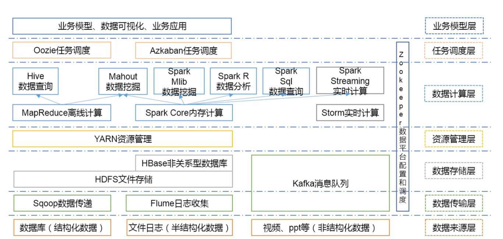
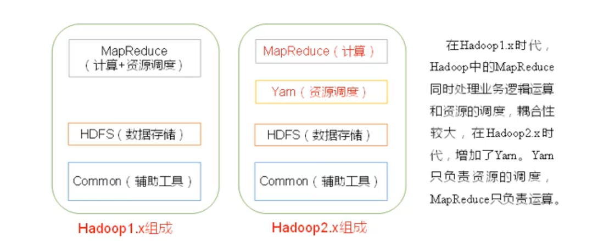
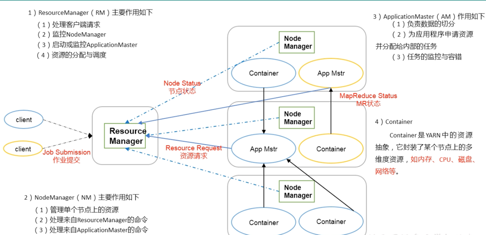
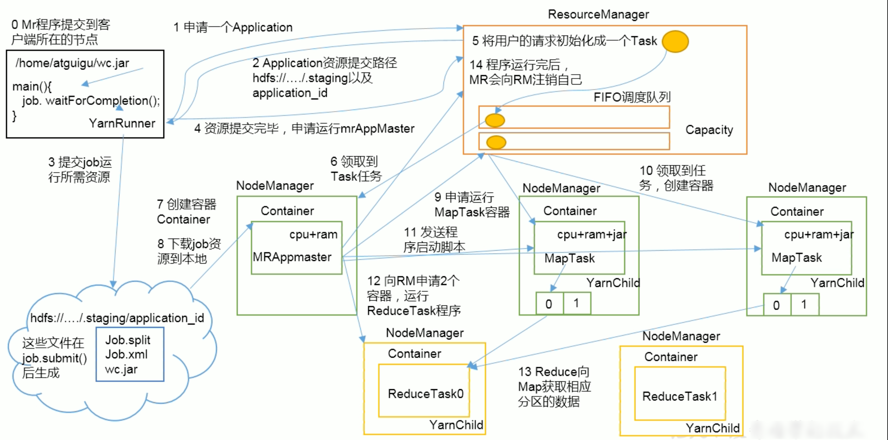

> [!IMPORTANT]
>
> 三篇Google的核心论文
>
> GFS  ->  HDFS 
>
> Map-Reduce ->  MR 
>
> BigTable  ->  HBase 

## 大数据技术生态体系

## Hadoop

分布式系统基础架构，主要解决海量数据的存储和海量数据的分析计算。

### Hadoop三大发行版本

1. Apache Hadoop : https://hadoop.apache.org/
2. Cloudera Hadoop：https://archive.cloudera.com/p/
3. Hortonworks Hadoop

### Hadoop 4大优势

高可靠性、高扩展性、高效性（并行工作）、高容错性（自动将失败的任务重新分配）

### Hadoop 2.X 的组成 

#### MapReduce 计算

MapReduce将计算分为两个阶段： Map和Reduce

1. Map阶段并行处理数据
2. Reduce阶段对Map结果进行汇总

#### Yarn 资源调度

#### HDFS 数据存储

	1. NameNode 存储文件的元数据：如文件名，文件目录结构，文件属性，每个文件的块列表和块所在的DataNode等
	1. DataNode 在本地文件系统存储文件块数据，以及块数据的校验和
	1. Secondary NameNode（2nn） 辅助NameNode进行工作（用来监控HDFS状态的辅助后台程序，每隔一段时间获取HDFS元数据的快照）

#### Common 辅助工具

不知道干啥的

## HBase

HBase是一个高可靠性、高性能、面向列、可伸缩的分布式存储系统，利用HBASE技术可在廉价PC Server上搭建起大规模结构化存储集群。

作用： 实现在HDFS上随机读写

## 参考

https://edu.aliyun.com/course/312683/lesson/341617461

