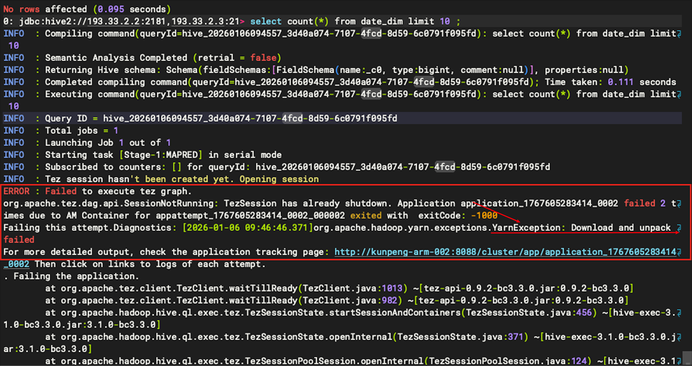

## TPC-DS介绍

## TPC-DS部署

1. 下载hive-testbench，按照README操作失败，因为./tpcds-build.sh 会下载一些包，但是下载链接已经失效。只能下载客户以前下载的包来使用

   https://github.com/hortonworks/hive-testbench/tree/hdp3

2. 客户已经下载的dsdgen为x86版本，需要下载源码进行编译，按照README操作

   https://github.com/databricks/tpcds-kit

3. 使用dsdgen构造2GB数据（其中2表示2GB；/home/wwh/guozhicong/2表示本地数据存储路径）

    ./dsdgen -scale 2 -dir /home/wwh/guozhicong/2  -terminate N 

4. hdfs下创建/tmp/tpcds-generate/2目录

   ```shell
   cd /home/wwh/hive-testbench-hdp3
   bash -x ./tpcds-setup.sh 2   
   # 执行报错不需要管, 只需要看/tmp/tpcds-generate是否有2这个路径
   
   [root@kunpeng-arm-001 hive-testbench-hdp3]# hdfs dfs -ls /tmp/tpcds-generate
   26/01/05 09:41:50 WARN security.UserGroupInformation: Exception encountered while running the renewal command for hive/kunpeng_arm_330p21@CMSSKDC. (TGT end time:Mon Jan 05 09:55:11 CST 2026, renewalFailures: 0,renewalFailuresTotal: 1)
   Found 2 items
   drwxr-x---   - hive hdfs          0 2026-01-05 09:41 /tmp/tpcds-generate/2
   ```

5. 将数据导入hdfs

   ```shell
   
   # 创建目录(因为TPC-DS工具会从对应的目录下取.dat文件，所以增加了目录)
   hdfs dfs -mkdir  /tmp/tpcds-generate/2/call_center            
   hdfs dfs -mkdir  /tmp/tpcds-generate/2/catalog_page           
   hdfs dfs -mkdir  /tmp/tpcds-generate/2/catalog_returns        
   hdfs dfs -mkdir  /tmp/tpcds-generate/2/catalog_sales          
   hdfs dfs -mkdir  /tmp/tpcds-generate/2/customer              
   hdfs dfs -mkdir  /tmp/tpcds-generate/2/customer_address       
   hdfs dfs -mkdir  /tmp/tpcds-generate/2/customer_demographics           
   hdfs dfs -mkdir  /tmp/tpcds-generate/2/date_dim              
   hdfs dfs -mkdir  /tmp/tpcds-generate/2/dbgen_version          
   hdfs dfs -mkdir  /tmp/tpcds-generate/2/household_demographics 
   hdfs dfs -mkdir  /tmp/tpcds-generate/2/income_band            
   hdfs dfs -mkdir  /tmp/tpcds-generate/2/inventory              
   hdfs dfs -mkdir  /tmp/tpcds-generate/2/item              
   hdfs dfs -mkdir  /tmp/tpcds-generate/2/promotion              
   hdfs dfs -mkdir  /tmp/tpcds-generate/2/reason            
   hdfs dfs -mkdir  /tmp/tpcds-generate/2/ship_mode              
   hdfs dfs -mkdir  /tmp/tpcds-generate/2/store              
   hdfs dfs -mkdir  /tmp/tpcds-generate/2/store_returns          
   hdfs dfs -mkdir  /tmp/tpcds-generate/2/store_sales            
   hdfs dfs -mkdir  /tmp/tpcds-generate/2/time_dim              
   hdfs dfs -mkdir  /tmp/tpcds-generate/2/warehouse              
   hdfs dfs -mkdir  /tmp/tpcds-generate/2/web_page              
   hdfs dfs -mkdir  /tmp/tpcds-generate/2/web_returns            
   hdfs dfs -mkdir  /tmp/tpcds-generate/2/web_sales              
   hdfs dfs -mkdir  /tmp/tpcds-generate/2/web_site    
   
   hdfs dfs -put /home/wwh/guozhicong/2/call_center.dat                /tmp/tpcds-generate/2/call_center 
   hdfs dfs -put /home/wwh/guozhicong/2/catalog_page.dat               /tmp/tpcds-generate/2/catalog_page
   hdfs dfs -put /home/wwh/guozhicong/2/catalog_returns.dat            /tmp/tpcds-generate/2/catalog_returns        
   hdfs dfs -put /home/wwh/guozhicong/2/catalog_sales.dat              /tmp/tpcds-generate/2/catalog_sales          
   hdfs dfs -put /home/wwh/guozhicong/2/customer.dat                /tmp/tpcds-generate/2/customer       
   hdfs dfs -put /home/wwh/guozhicong/2/customer_address.dat           /tmp/tpcds-generate/2/customer_address       
   hdfs dfs -put /home/wwh/guozhicong/2/customer_demographics.dat      /tmp/tpcds-generate/2/customer_demographics   
   hdfs dfs -put /home/wwh/guozhicong/2/date_dim.dat                /tmp/tpcds-generate/2/date_dim       
   hdfs dfs -put /home/wwh/guozhicong/2/dbgen_version.dat              /tmp/tpcds-generate/2/dbgen_version          
   hdfs dfs -put /home/wwh/guozhicong/2/household_demographics.dat     /tmp/tpcds-generate/2/household_demographics  
   hdfs dfs -put /home/wwh/guozhicong/2/income_band.dat                /tmp/tpcds-generate/2/income_band 
   hdfs dfs -put /home/wwh/guozhicong/2/inventory.dat                 /tmp/tpcds-generate/2/inventory     
   hdfs dfs -put /home/wwh/guozhicong/2/item.dat                 /tmp/tpcds-generate/2/item            
   hdfs dfs -put /home/wwh/guozhicong/2/promotion.dat                /tmp/tpcds-generate/2/promotion     
   hdfs dfs -put /home/wwh/guozhicong/2/reason.dat                /tmp/tpcds-generate/2/reason            
   hdfs dfs -put /home/wwh/guozhicong/2/ship_mode.dat                /tmp/tpcds-generate/2/ship_mode     
   hdfs dfs -put /home/wwh/guozhicong/2/store.dat                 /tmp/tpcds-generate/2/store            
   hdfs dfs -put /home/wwh/guozhicong/2/store_returns.dat              /tmp/tpcds-generate/2/store_returns         
   hdfs dfs -put /home/wwh/guozhicong/2/store_sales.dat                /tmp/tpcds-generate/2/store_sales 
   hdfs dfs -put /home/wwh/guozhicong/2/time_dim.dat                /tmp/tpcds-generate/2/time_dim       
   hdfs dfs -put /home/wwh/guozhicong/2/warehouse.dat                /tmp/tpcds-generate/2/warehouse     
   hdfs dfs -put /home/wwh/guozhicong/2/web_page.dat                /tmp/tpcds-generate/2/web_page       
   hdfs dfs -put /home/wwh/guozhicong/2/web_returns.dat                /tmp/tpcds-generate/2/web_returns 
   hdfs dfs -put /home/wwh/guozhicong/2/web_sales.dat                /tmp/tpcds-generate/2/web_sales     
   hdfs dfs -put /home/wwh/guozhicong/2/web_site.dat                /tmp/tpcds-generate/2/web_site       
   ```

6. 修改hive-site.xml 配置

    ```shell
    # 添加如下配置
    <property>
      <name>hive.support.concurrency</name>
      <value>true</value>
    </property>
    
    # 将tez修改为mr
    <property>
      <name>hive.execution.engine</name>
      <value>mr</value>
    </property>
    ```

    修改后重启hive （部署hive的节点都重启）

    ```shell
    su hive
    ps -ef | grep hive 
    # 直接kill hiveserver2进程后再kill metastore进程
    
    # 重启metastore 和 hiveserver2 （注意按顺序执行）
    hive --service metastore &
    hive --service hiveserver2 &
    ```

    或者在管理平台修改配置并重启hive所有节点

    

7. 构造测试数据库表

    ```shell
    bash -x ./tpcds-setup.sh 2
    ```

    回显结果如下：

    

8. 验证数据库表是否成功创建，并有数据

     ```shell
     show databases;
     use tpcds_bin_partitioned_orc_2;
     show tables;
     select * from date_dim limit 10;
     ```

9. 执行测试

    ```shell
    su hive
    # kerberos认证
    klist -kt /etc/security/keytabs/hive.service.keytab
    kinit -kt /etc/security/keytabs/hive.service.keytab xxx@xxx
    
    # 连接hive
    /usr/bch/3.3.0/hive/bin/beeline -u   'jdbc:hive2://193.33.2.2:2181,193.33.2.3:2181,193.33.2.4:2181/default;serviceDiscoveryMode=zookeeper;zooKeeperNamespace=hiveserver2;principal=hive/kunpeng-arm-001@CMSSKDC'systemctl list-units --type=service
    
    # 使用测试数据库tpcds_bin_partitioned_orc_2
    use tpcds_bin_partitioned_orc_2;
    # 执行测试sql，压测完有执行结果回显
    source /home/wwh/hive-testbench-hdp3/sample-queries-tpcds/query53.sql;
    ```

    

10. 由于MR执行引擎性能较差，需要切换执行引擎为tez （参考操作6）

    报错信息：重点关注YarnException: Download and unpack failed

    

    ```shell
    INFO  : Query ID = hive_20260105154252_4bde9af4-e6f9-45da-8162-fef2998656b2
    INFO  : Total jobs = 1
    INFO  : Launching Job 1 out of 1
    INFO  : Starting task [Stage-1:MAPRED] in serial mode
    INFO  : Subscribed to counters: [] for queryId: hive_20260105154252_4bde9af4-e6f9-45da-8162-fef2998656b2
    INFO  : Tez session hasn't been created yet. Opening session
    ERROR : Failed to execute tez graph.
    org.apache.tez.dag.api.SessionNotRunning: TezSession has already shutdown. Application application_1767595362433_0006 failed 2 times due to AM Container for appattempt_1767595362433_0006_000002 exited with  exitCode: -1000
    Failing this attempt.Diagnostics: [2026-01-05 15:43:27.855]org.apache.hadoop.yarn.exceptions.YarnException: Download and unpack failed
    For more detailed output, check the application tracking page: http://kunpeng-arm-001:8088/cluster/app/application_1767595362433_0006 Then click on links to logs of each attempt.
    . Failing the application.
            at org.apache.tez.client.TezClient.waitTillReady(TezClient.java:1013) ~[tez-api-0.9.2-bc3.3.0.jar:0.9.2-bc3.3.0]
            at org.apache.tez.client.TezClient.waitTillReady(TezClient.java:982) ~[tez-api-0.9.2-bc3.3.0.jar:0.9.2-bc3.3.0]
            at org.apache.hadoop.hive.ql.exec.tez.TezSessionState.startSessionAndContainers(TezSessionState.java:456) ~[hive-exec-3.1.0-bc3.3.0.jar:3.1.0-bc3.3.0]
            at org.apache.hadoop.hive.ql.exec.tez.TezSessionState.openInternal(TezSessionState.java:371) ~[hive-exec-3.1.0-bc3.3.0.jar:3.1.0-bc3.3.0]
            at org.apache.hadoop.hive.ql.exec.tez.TezSessionPoolSession.openInternal(TezSessionPoolSession.java:124) ~[hive-exec-3.1.0-bc3.3.0.jar:3.1.0-bc3.3.0]
            at org.apache.hadoop.hive.ql.exec.tez.TezSessionState.open(TezSessionState.java:245) ~[hive-exec-3.1.0-bc3.3.0.jar:3.1.0-bc3.3.0]
            at org.apache.hadoop.hive.ql.exec.tez.TezTask.ensureSessionHasResources(TezTask.java:368) ~[hive-exec-3.1.0-bc3.3.0.jar:3.1.0-bc3.3.0]
            at org.apache.hadoop.hive.ql.exec.tez.TezTask.execute(TezTask.java:195) ~[hive-exec-3.1.0-bc3.3.0.jar:3.1.0-bc3.3.0]
            at org.apache.hadoop.hive.ql.exec.Task.executeTask(Task.java:205) ~[hive-exec-3.1.0-bc3.3.0.jar:3.1.0-bc3.3.0]
            at org.apache.hadoop.hive.ql.exec.TaskRunner.runSequential(TaskRunner.java:97) ~[hive-exec-3.1.0-bc3.3.0.jar:3.1.0-bc3.3.0]
            at org.apache.hadoop.hive.ql.Driver.launchTask(Driver.java:2679) ~[hive-exec-3.1.0-bc3.3.0.jar:3.1.0-bc3.3.0]
            at org.apache.hadoop.hive.ql.Driver.execute(Driver.java:2336) ~[hive-exec-3.1.0-bc3.3.0.jar:3.1.0-bc3.3.0]
            at org.apache.hadoop.hive.ql.Driver.runInternal(Driver.java:2012) ~[hive-exec-3.1.0-bc3.3.0.jar:3.1.0-bc3.3.0]
            at org.apache.hadoop.hive.ql.Driver.run(Driver.java:1710) ~[hive-exec-3.1.0-bc3.3.0.jar:3.1.0-bc3.3.0]
            at org.apache.hadoop.hive.ql.Driver.run(Driver.java:1704) ~[hive-exec-3.1.0-bc3.3.0.jar:3.1.0-bc3.3.0]
            at org.apache.hadoop.hive.ql.reexec.ReExecDriver.run(ReExecDriver.java:157) ~[hive-exec-3.1.0-bc3.3.0.jar:3.1.0-bc3.3.0]
            at org.apache.hive.service.cli.operation.SQLOperation.runQuery(SQLOperation.java:224) ~[hive-service-3.1.0-bc3.3.0.jar:3.1.0-bc3.3.0]
            at org.apache.hive.service.cli.operation.SQLOperation.access$700(SQLOperation.java:87) ~[hive-service-3.1.0-bc3.3.0.jar:3.1.0-bc3.3.0]
            at org.apache.hive.service.cli.operation.SQLOperation$BackgroundWork$1.run(SQLOperation.java:316) ~[hive-service-3.1.0-bc3.3.0.jar:3.1.0-bc3.3.0]
            at java.security.AccessController.doPrivileged(Native Method) ~[?:1.8.0_191]
            at javax.security.auth.Subject.doAs(Subject.java:422) ~[?:1.8.0_191]
            at org.apache.hadoop.security.UserGroupInformation.doAs(UserGroupInformation.java:1699) ~[hadoop-common-3.1.0-bc3.3.0.jar:?]
            at org.apache.hive.service.cli.operation.SQLOperation$BackgroundWork.run(SQLOperation.java:329) ~[hive-service-3.1.0-bc3.3.0.jar:3.1.0-bc3.3.0]
            at java.util.concurrent.Executors$RunnableAdapter.call(Executors.java:511) ~[?:1.8.0_191]
            at java.util.concurrent.FutureTask.run(FutureTask.java:266) ~[?:1.8.0_191]
            at java.util.concurrent.ThreadPoolExecutor.runWorker(ThreadPoolExecutor.java:1149) ~[?:1.8.0_191]
            at java.util.concurrent.ThreadPoolExecutor$Worker.run(ThreadPoolExecutor.java:624) ~[?:1.8.0_191]
            at java.lang.Thread.run(Thread.java:748) [?:1.8.0_191]
    ERROR : FAILED: Execution Error, return code 1 from org.apache.hadoop.hive.ql.exec.tez.TezTask
    INFO  : Completed executing command(queryId=hive_20260105154252_4bde9af4-e6f9-45da-8162-fef2998656b2); Time taken: 32.516 seconds
    Error: Error while processing statement: FAILED: Execution Error, return code 1 from org.apache.hadoop.hive.ql.exec.tez.TezTask (state=08S01,code=1)
    ```


​	**解决方法**： 主要看Download and unpack failed` 或 `BlockMissingException报错

​	**典型日志**：

```
failed 2 times due to AM Container for appattempt_xxx exited with exitCode: 1
Diagnostics: org.apache.hadoop.yarn.exceptions.YarnException: Download and unpack failed
```

**解决方案**：

1. 验证 HDFS 上 tez.tar.gz包的完整性：

   ```
   # 查看tez.tar.gz是否损坏
   hdfs fsck /bch/apps/3.3.0/tez/tez.tar.gz -files -blocks -locations
   # 损坏的包无法正常get
   hdfs dfs -get /bch/apps/3.3.0/tez/tez.tar.gz /tmp/
   tar -tzf /tmp/tez-0.10.2.tar.gz  # 无报错则包完好
   ```

2. 清理 YARN NodeManager 本地 usercache缓存（所有节点执行）：

   ```
   yarn-daemon.sh stop nodemanager
   rm -rf /tmp/yarn-local/usercache/*  # 替换为你的local-dirs路径
   yarn-daemon.sh start nodemanager
   ```

3. 确保 `tez.lib.uris` 配置为 HDFS 绝对路径：`hdfs:///user/tez/tez-0.10.2.tar.gz`