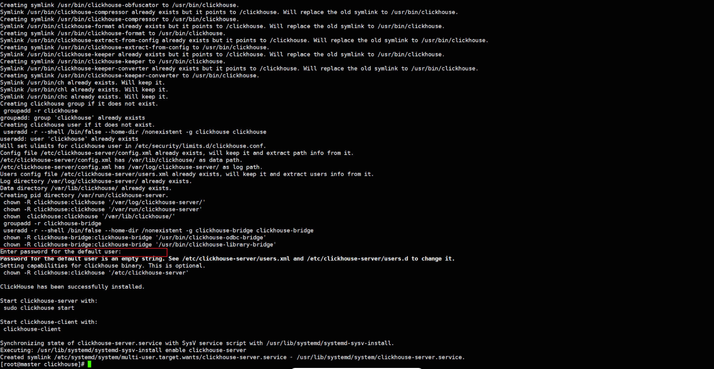
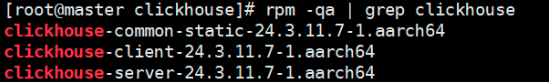

## 问题

网安项目 大数据基座

dpi输出的事件会存到这个事件，数据中台ck会做改造


版本确定哪个版本上线（现网 x86 25版本。 Arm 23.3，因为23.6版本之后鲲鹏没法用）

时间点： 

服务器配置型号： 


也没有慢sql

数据量大的情况才会出现问题，单点异常连接数。

现网业务已经在执行；

张琦


资源情况也很充足 

openEuler 22.03 SP1 

## ClickHouse介绍

​	ClickHouse是一个用于联机分析（OLAP）的列式数据库管理系统（DBMS），简称CK。支持线性扩展，简单方便，具有高可靠性。主要功能：支持数据统计分析各种场景、类SQL查询、异地复制部署。

## ClickHouse部署

参考： [鲲鹏社区部署指南](https://www.hikunpeng.com/document/detail/zh/kunpengbds/ecosystemEnable/ClickHouse/kunpengclickhouse_04_0001.html)

1. 创建ClickHouse安装目录，以“/home/clickhouse”为例，进入该目录。

   ```shell
   mkdir -p /home/clickhouse
   cd /home/clickhouse
   ```

2. 下载RPM包。

   ```shell
   wget https://github.com/ClickHouse/ClickHouse/releases/download/v24.3.11.7-lts/clickhouse-server-24.3.11.7.aarch64.rpm --no-check-certificate
   wget https://github.com/ClickHouse/ClickHouse/releases/download/v24.3.11.7-lts/clickhouse-common-static-24.3.11.7.aarch64.rpm  --no-check-certificate
   wget https://github.com/ClickHouse/ClickHouse/releases/download/v24.3.11.7-lts/clickhouse-client-24.3.11.7.aarch64.rpm --no-check-certificate
   ```

3. 安装RPM包。

   ```shell
   rpm -ivh clickhouse-common-static-24.3.11.7.aarch64.rpm
   rpm -ivh clickhouse-client-24.3.11.7.aarch64.rpm
   rpm -ivh clickhouse-server-24.3.11.7.aarch64.rpm
   ```

   安装clickhouse-server-24.3.11.7.aarch64.rpm会出现“Enter password for the default user”后，按“Enter”继续安装。

   

   

   

4. 检查RPM包是否成功安装。

   ```shell
   rpm -qa | grep clickhouse
   ```

   

   

   

5. 启动Clickhouse Server。

   ```shell
   clickhouse start
   ```

6. 验证Server是否启动成功。

   如进程中存在ClickHouse，表示启动成功。

   ```shell
   ps -ef | grep clickhouse
   ```

   

7. 登录ClickHouse。

   ```shell
   clickhouse client
   ```

## 性能测试


## 性能优化

