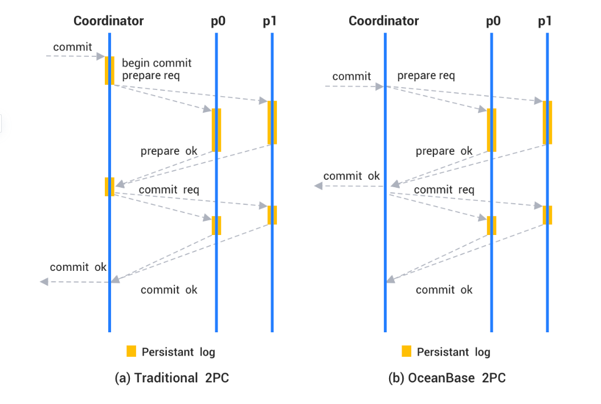

## 事务

数据库事务具有 4 个特性：原子性、一致性、隔离性、持久性。这四个属性通常称为 ACID 特性。

- 原子性

  OceanBase 数据库是一个分布式系统，分布式事务操作的表或者分区可能分布在不同机器上，OceanBase 数据库采用两阶段提交协议保证事务的原子性，确保多台机器上的事务要么都提交成功要么都回滚。

- 一致性

  事务必须是使数据库从一个一致性状态变到另一个一致性状态。一致性与原子性是密切相关的。

- 隔离性

  OceanBase 数据库支持 Oracle 和 MySQL 兼容模式。在 Oracle 模式下，支持 Read Committed 隔离级别和 Serializable 隔离级别。在 MySQL 模式下，支持 Read Committed 隔离级别、 Repeatable Read 隔离级别和 Serializable 隔离级别。

- 持久化 

  对于单个机器来说，OceanBase 数据库通过 redo log 记录了数据的修改，通过 WAL 机制保证在宕机重启之后能够恢复出来。保证事务一旦提交成功，事务数据一定不会丢失。对于整个集群来说，OceanBase 数据库通过 paxos 协议将数据同步到多个副本，只要多数派副本存活事务数据一定不会丢失。

## Redo 日志

OceanBase 数据库的 Redo 日志有两个主要作用：

- 宕机恢复

  与大多数主流数据库相同，OceanBase 数据库遵循 WAL（write-ahead logging）原则，在事务提交前将 Redo 日志持久化，保证事务的原子性和持久性（ ACID 中的 "A" 和 "D"）。如果 observer 进程退出或所在的服务器宕机，重启 OBServer 会扫描并回放本地的 Redo 日志用于恢复数据。宕机时未持久化的数据会随着 Redo 日志的回放而重新产生。

- 多副本数据一致性

  OceanBase 数据库采用 Multi-Paxos 协议在多个副本间同步 Redo 日志。对于事务层来说，一次 Redo 日志的写入只有同步到多数派副本上时才能认为成功。而事务的提交需要所有 Redo 日志都成功写入。最终，所有副本都会收到相同的一段 Redo 日志并回放出数据。这就保证了一个成功提交的事务的修改最终会在所有副本上生效并保持一致。Redo 日志在多个副本上的持久化使得 OceanBase 数据库可以提供更强的容灾能力。

## Clog

OceanBase 数据库的 Redo 日志文件称为 Clog，Clog 全称 Commit log，用于记录 Redo 日志的日志内容，位于 `store/clog/tenant_xxxx` 目录下（其中，xxxx表示租户 ID），文件编号从 0 开始并连续递增，文件 ID 不会复用，单个日志文件的大小为 64 MB。这些日志文件记录数据库中的数据所做的更改操作，提供数据持久性保证。

## 日志的回放

Redo 日志的回放是 OceanBase 数据库提供高可用能力的基础。日志同步到 Follower 副本后，副本会将日志按照 `transaction_id` 哈希到同一个线程池的不同任务队列中进行回放。OceanBase 数据库中不同事务的 Redo 日志并行回放，同一事务的 Redo 日志串行回放，在提高回放速度的同时保证了回放的正确性。日志在副本上回放时首先会创建出事务上下文，然后在事务上下文中还原出操作历史，并在回放到 Commit 日志时将事务提交，相当于事务在副本的镜像上又执行了一次。

## 事务的管理

- 开启一个事务，会在当前租户下的表中申请一个事务id进行管理： select * from oceanbase.__all_virtual_trans_stat\G;

## 事务类别

- 本地事务

  

- 分布式事务

- XA事务

## 两阶段提交

详细过程： https://zhuanlan.zhihu.com/p/145364298

