## 简介

业务上线前的性能测试中，OceanBase集群出现的性能劣化问题定位。


## 环境配置

### 硬件信息

| 硬件     | 型号                                  |
| -------- | ------------------------------------- |
| CPU      | Kunpeng 920 5250 (2 * 48 Core 2.6GHz) |
| 内存     | 8 * 32GB 2666 MT/s DDR4               |
| 硬盘     | 4 * 1.1 TB TOSHIBA SAS HDD            |
| 网卡     | TM210 4*GE / TM280 4*25GE             |
| 操作系统 | openEuler 22.03 (LTS-SP4)             |


### 软件栈信息

| 软件               | 版本    |
| ------------------ | ------- |
| OceanBase Database | 4.3.5.1 |
| OBProxy            | 4.3.3.0 |
| OCP Express        | 4.2.2   |
| OBAgent            | 4.2.2   |
| Sysbench           | 1.0.17  |


### 组网图

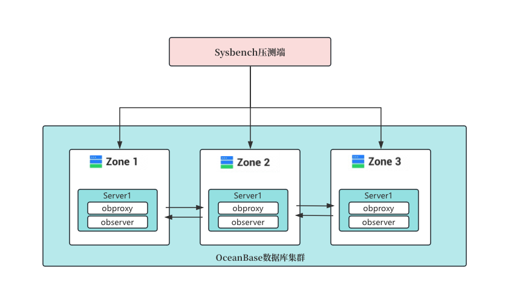

## 基本介绍

### OceanBase 基本概念

OceanBase 是 阿里巴巴自主研发的一个分布式数据库系统，基于单机分布式一体化架构，高度兼容 Oracle 和 MySQL，支持事务处理（TP）和实时分析处理（AP）等多工作负载，原生支持向量检索与多模数据混合检索。设计目的是为了解决海量数据的存储和处理问题，已广泛应用于金融、运营商、零售、互联网及公共服务等行业。

### OceanBase 组件介绍


### OceanBase 常见的组网架构

OceanBase 数据库支持无共享（Shared-Nothing，SN）模式和共享存储（Shared-Storage，SS）模式两种部署模式。在广东和江苏移动CRM和BOSS系统中使用的均为无共享（Shared-Nothing，SN）模式，组网主要是3:3:3和2:2:2为主，极少集群使用1:1:1（负载非常低的业务），服务器使用鲲鹏920 5250 4P机型。


## 性能测试用例

> 电口测试命令

---

####  cleanup 清除数据库测试数据

```shell
sysbench oltp_point_select.lua --mysql-host=175.11.22.4 --mysql-port=2881 --mysql-db=sysbench --mysql-user=root@sysbench --mysql-password='mq0+fydH{J3cq]qzOhG' --table_size=2000000 --tables=100 --threads=50 --report-interval=10 --time=60 cleanup
```

#### prepare 生产数据库测试数据

```shell
sysbench oltp_point_select.lua --mysql-host=175.11.22.4 --mysql-port=2881 --mysql-db=sysbench --mysql-user=root@sysbench --mysql-password='mq0+fydH{J3cq]qzOhG' --table_size=2000000 --tables=100 --threads=5 --report-interval=10 --time=60 prepare
```

#### test 启动测试

```shell
sysbench oltp_point_select.lua --mysql-host=175.11.22.4 --mysql-port=2881 --mysql-db=sysbench --mysql-user=root@sysbench --mysql-password='mq0+fydH{J3cq]qzOhG' --table_size=2000000 --tables=100 --threads=500 --report-interval=10 --time=60 --db-ps-mode=disable run
```

---

> 光口测试命令

---

####  cleanup 清除数据库测试数据

```shell
sysbench oltp_point_select.lua --mysql-host=195.11.22.4 --mysql-port=2881 --mysql-db=sysbench --mysql-user=root@sysbench --mysql-password='TfHiN1-Zevd_KC{Qvo1m' --table_size=2000000 --tables=100 --threads=50 --report-interval=10 --time=60 cleanup
```

#### prepare 生产数据库测试数据

```shell
sysbench oltp_point_select.lua --mysql-host=195.11.22.4 --mysql-port=2881 --mysql-db=sysbench --mysql-user=root@sysbench --mysql-password='TfHiN1-Zevd_KC{Qvo1m' --table_size=2000000 --tables=100 --threads=8 --report-interval=10 --time=60 prepare
```

#### test 启动测试

```shell
sysbench oltp_point_select.lua --mysql-host=195.11.22.4 --mysql-port=2881 --mysql-db=sysbench --mysql-user=root@sysbench --mysql-password='TfHiN1-Zevd_KC{Qvo1m' --table_size=2000000 --tables=100 --threads=50 --report-interval=10 --time=60 --db-ps-mode=disable run
```

---


## OceanBase性能问题定位

### 1. 网络带来的性能瓶颈

#### 问题描述

用户反馈测试环境服务器在增加CPU使用率至20-30%左右，TOP SQL 时延会增加10倍以上，远远落后于当前现网环境性能。

#### 问题定位

1. TOP SQL 时延增加10倍以上的问题大概率是OceanBase数据库集群配置的资源不足（如CPU核数），或者是硬件存在性能瓶颈。所以首先是通过OceanBase数据库自带的OCP平台检查测试环境数据库集群配置和现网环境的差异点。查看相应租户的Unit规格配置，均与现网租户配置一致，无差异。

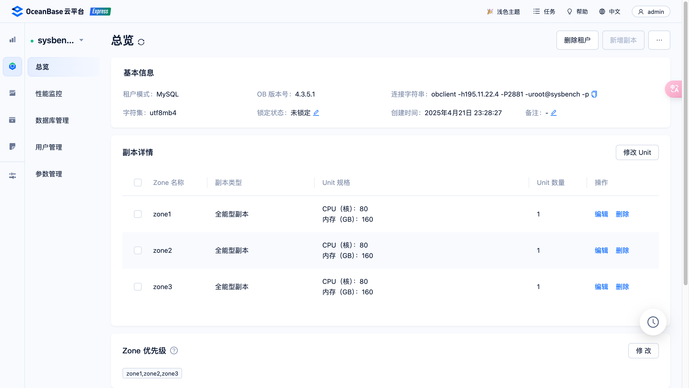

2. 数据库层面无配置问题，转而排查硬件层面是否存在瓶颈点。分别排查CPU、磁盘IO、网络IO问题（参考下面列出的命令），我们发现CPU整机负载较低，未到70%的使用率；磁盘IO基本没有；主要是网络IO达到117257.40KB/s，接近网络带宽（GE网口）。此处基本能确认性能问题主要是因为网络瓶颈导致的。
   - CPU： top
   - 磁盘IO： iostat -xm 1 10
   - 网络IO：  sar -n DEV 1 10

3. 排查测试环境和现网环境的网卡均为TM210和TM280 网卡，但是数据库业务口测试环境配置在TM210的电口，现网环境配置在TM280光口。传输速率和传输带宽存在明显差异，且一般业务口配置在光口上，因此重新修改数据库业务口配置，使其放在光口上，重新测试后性能正常。

   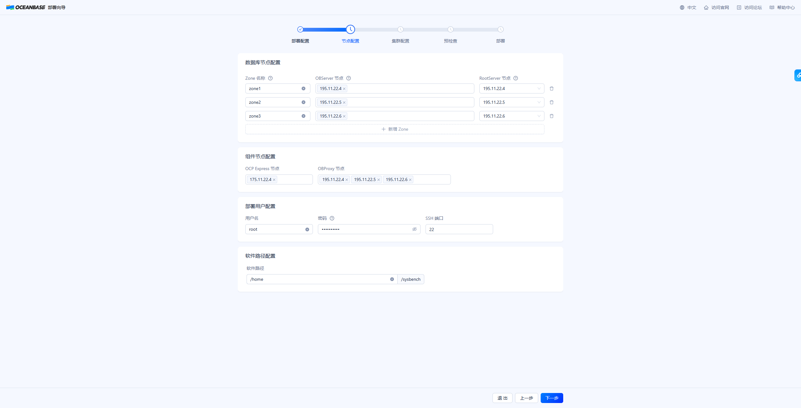

   

#### 参考测试数据

以下为Sysbench的在不同并发下的性能测试结果：

1. 使用电口作为业务口的数据库集群在并发线程达到100时，网口达到瓶颈，此后增加并发数也不会带来TPS的提升；

2. 使用光口作为业务口的数据库集群即使在400并发的情况下，网络和TPS均持续增加。**且100并发以下，即使电口未达到瓶颈，以光口作为业务口的集群性能仍更优**。

| thread | 电口 tps | 电口 txkB/s | 光口 tps  | 光口 txkB/s |
| ------ | -------- | ----------- | --------- | ----------- |
| 400    | 73656.04 | 118177.61   | 328073.06 | 518828.77   |
| 300    | 73843.17 | 118075.57   | 294612.96 | 475262.58   |
| 200    | 73808.72 | 117983.06   | 249008.25 | 399692.63   |
| 100    | 73084.44 | 117257.40   | 155287.49 | 249921.43   |
| 75     | 70903.75 | 112518.06   | 127540.77 | 203173.82   |
| 50     | 57072.58 | 93473.71    | 90080.09  | 144898.27   |
| 25     | 33547.46 | 55037.99    | 50330.55  | 81721.76    |
| 10     | 15553.46 | 26107.95    | 21941.82  | 35626.41    |
| 1      | 1700.73  | 3738.07     | 2045.00   | 4106.69     |


### 2. skew_tick=1导致的性能问题

#### 问题描述

用户反馈测试环境业务性能存在明显的性能下降问题，且无论是低并发还是高并发场景均相比之前的性能下降严重。

#### 问题定位

与上一小节**《网络带来的性能瓶颈》**一样，从OceanBase数据库配置以及服务器硬件入手查看是否存在瓶颈点，排查了CPU使用率、磁盘和网络IO，均为有异常情况。考虑到SQL 执行时延增加，可能是在CPU上的执行耗时增加，所以通过perf top 查询测试时的热点函数。可以看到存在占比远超5%的热点函数\_\_kernel\_\_gettimeofday和\_\_kernel_clock_gettime，但是正常情况下是没有占比如此高的热点函数的，所以主要排查两个函数的引入原因。

```she
# perf top 

   44.95%  [vdso]                                 [.] __kernel__gettimeofday
   11.24%  [vdso]                                 [.] __kernel_clock_gettime
   3.69%   [kernel]                               [k] finish_task_switch
```

通过命令cat /proc/cmdline  查询grub启动参数，发现新增了一个 skew_tick=1 参数。查询资料得知，skew_tick=1参数会导致内核频繁地调整时钟中断的触发时间，来降低多个 CPU 争用 Linux 内核计时器ticks处理程序中的公共锁的情况，从而减少中断响应时间的系统抖动，以此来提升性能。但是更频繁的时钟中断可能会导致更多的时间相关的系统调用，如 gettimeofday，引发了该问题的发生。

```shell
[root@localhost ~]# cat /proc/cmdline 
BOOT_IMAGE=/vmlinuz-5.10.0-216.0.0.115.oe2203sp4.aarch64 root=/dev/mapper/openeuler-root ro rd.lvm.lv=openeuler/root rd.lvm.lv=openeuler/swap video=VGA-1:640x480-32@60me cgroup_disable=files apparmor=0 crashkernel=1024M,high smmu.bypassdev=0x1000:0x17 smmu.bypassdev=0x1000:0x15 arm64.nopauth console=tty0 skew_tick=1
```

排查skew_tcik=1参数配置的原因，发现此前在优化低时延场景的业务时，修改了网络时延模式tuned-adm profile network-latency。 该配置会引入skew_tcik=1参数配置，引发了该问题。回退后（tuned-adm profile throughput-performance），两个热点函数\_\_kernel\_\_gettimeofday和\_\_kernel_clock_gettime占比均下降至5%以下，数据库集群性能正常。

```shell
# 删除skew_tcik=1参数后的perf top

   3.70%  observer                                [.] oceanbase::omt::ObThWorker::worker
   3.53%  observer                                [.] oceanbase::observer::ObMPQuery::process_single_stmt
   2.00%  [kernel]                                [k] finish_task_switch
   1.92%  observer                                [.] oceanbase::common::ObKVCacheMap::get
```


#### 参考资料

1. 修改 tuned-adm profile network-latency 会引入的配置

```shell
[root@localhost ~]# cat /usr/lib/tuned/network-latency/tuned.conf
#
# tuned configuration
#

[main]
summary=Optimize for deterministic performance at the cost of increased power consumption, focused on low latency network performance
include=latency-performance

[vm]
transparent_hugepages=never

[sysctl]
net.core.busy_read=50
net.core.busy_poll=50
net.ipv4.tcp_fastopen=3
kernel.numa_balancing=0

[bootloader]
cmdline_network_latency=skew_tick=1
```


## OceanBase 社区版本安装部署

### 依赖安装

```bash
yum install tar ntpdate net-tools -y
```

### 关闭防火墙

```bash
systemctl stop firewalld
systemctl disable firewalld
systemctl status firewalld
```

### 启动时钟同步

```bash
[root@localhost ~]# ntpdate ntp.aliyun.com 
21 Apr 17:21:18 ntpdate[29201]: step time server 203.107.6.88 offset -2.902955 sec
```


### 安装obd

> obd 全称为 OceanBase Deployer，是 OceanBase 安装部署工具，通过命令行部署或白屏界面部署的方式，将复杂配置流程标准化，降低集群部署难度。详细操作可参考 [单机部署 OceanBase 数据库](https://www.oceanbase.com/docs/community-obd-cn-1000000002691307) 和 [通过白屏部署 OceanBase 集群](https://www.oceanbase.com/docs/community-obd-cn-1000000002691291)

通过OceanBase All in One 【包含OceanBase 数据库软件和 OCP、obd、OBProxy（又称为 ODP）、OBClient、OCP Express（自 V4.1.0 起支持）、Prometheus、Grafana，以及诊断和测试工具】安装obd

```bash
[root@localhost home]# bash -c "$(curl -s https://obbusiness-private.oss-cn-shanghai.aliyuncs.com/download-center/opensource/oceanbase-all-in-one/installer.sh)"

# 回显结果如下表示obd安装成功
...
add auto set env logic to profile: /root/.bash_profile

#########################################################################################
 Install Finished 
=========================================================================================
Setup Environment:              source ~/.oceanbase-all-in-one/bin/env.sh 
Quick Start:                    obd demo 
Use Web Service to install:     obd web 
Use Web Service to upgrade:     obd web upgrade 
More Details:                   obd -h 
=========================================================================================

[root@localhost home]# source ~/.oceanbase-all-in-one/bin/env.sh

```

### 启动obd图形化界面

```bash
[root@localhost home]# obd web 
start OBD WEB in 0.0.0.0:8680
please open http://127.0.0.1:8680

```

通过 http://175.11.22.4:8680/ 浏览器访问obd 图形化界面，并点击开启体验之旅

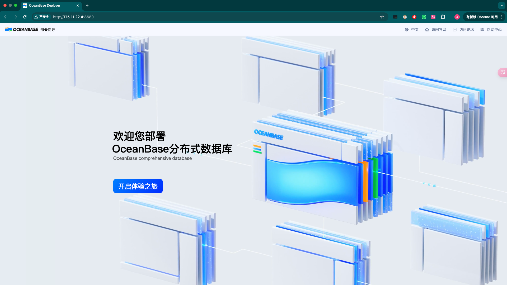

### 选择OceanBase 云平台

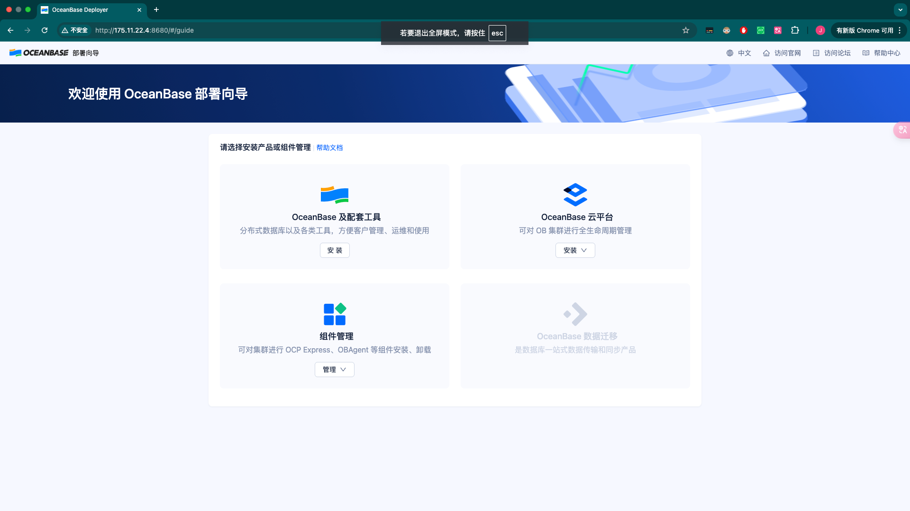

### 部署配置

版本选择和集群名称可根据需要配置

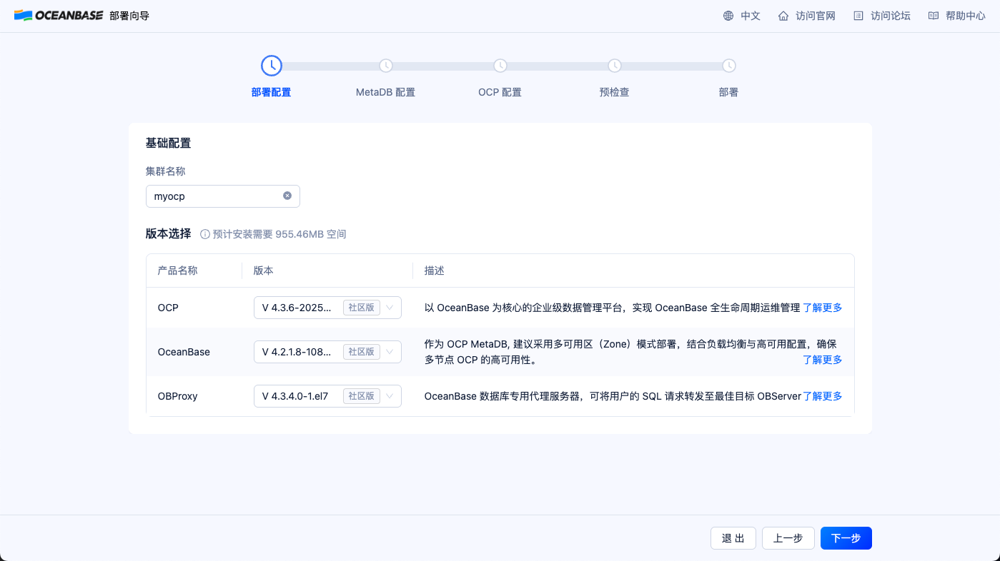

### MetaDB配置

本次部署1:1:1集群，共3个zone，每个zone有一台服务器，每台服务器包含一个OBServer和一个OBProxy进程

> [!NOTE]
>
> 1. 部署用户配置的密码为服务器root密码。
> 2. OCP 节点配置和数据库节点配置使用电口ip，OBProxy请使用光口ip。若OBProxy使用电口ip，业务会使用电口进行数据传输，影响数据库性能。
> 3. 数据路径和安装路径等均使用/home目录，因为默认使用的根目录磁盘空间不足（df -h命令查询），影响数据库集群内存分配。

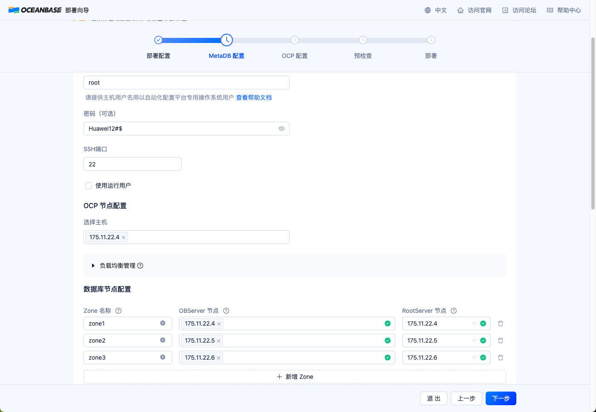

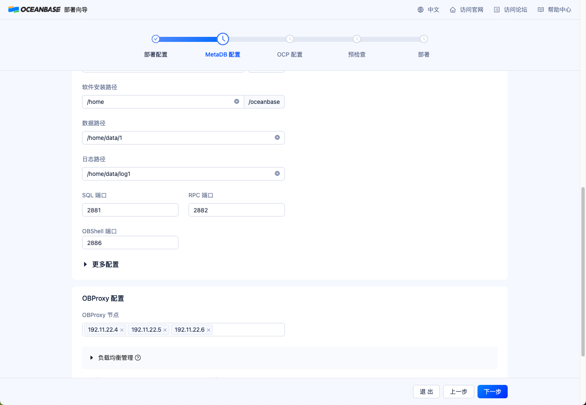

### OCP配置

服务配置和资源规划等按照默认配置即可。（密码可以随机生成）

> [!NOTE]
>
> 软件路径和日志路径等均使用/home目录，因为默认使用的根目录磁盘空间不足（df -h命令查询），影响数据库集群内存分配。

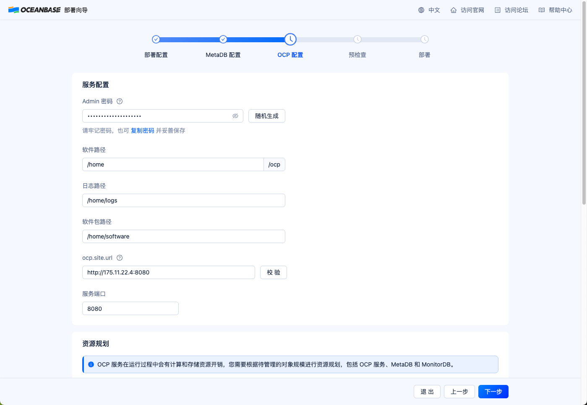

### 预检查

检查OceanBase数据库集群配置是否正确，如果正确则点击预检查


### 预检查报错修复

请根据报错提示信息修复环境问题，修复后点击重新检查指导预检查项全部通过。

> [!NOTE]
>
> 如果出现时钟同步问题，请参考FAQ 2

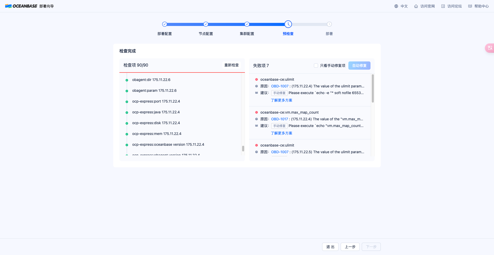

预检查成功后，点击部署

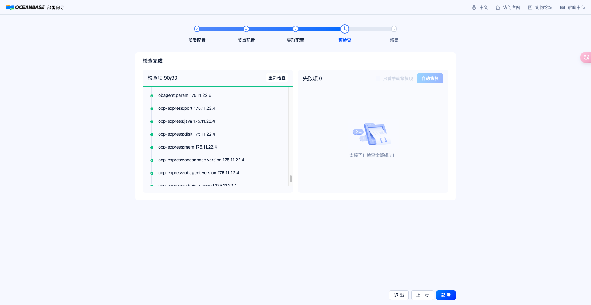

### 启动部署

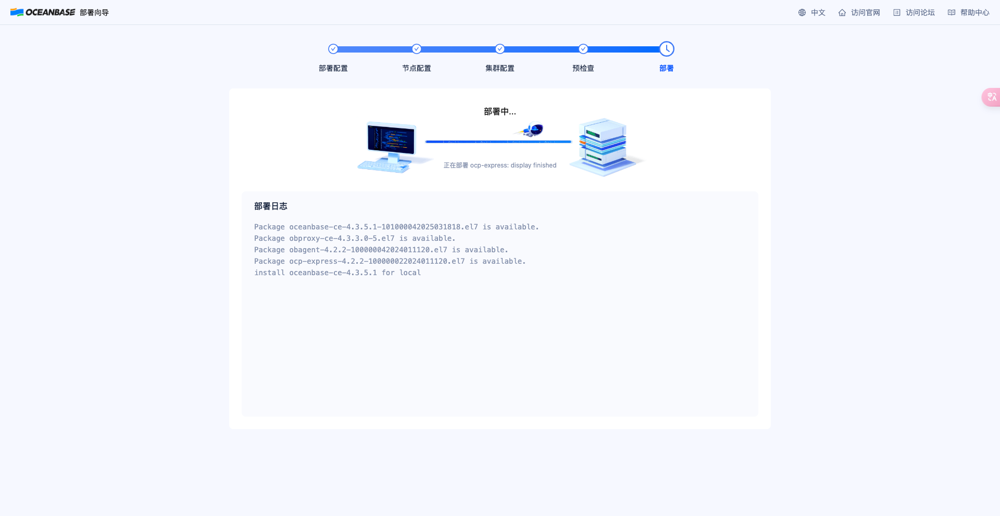

部署成功后，保存OceanBase数据库集群信息

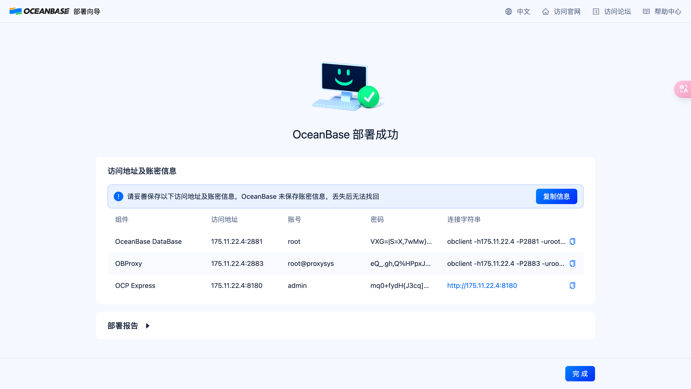

### 保存的集群信息

```shell
sys@root密码
1sVMipByr)Pk*^7aF

ocp admin
HX{h0Sq8VL61nJLh

ocp_meta
]8wT-8|z#@^KU67E

ocp_monitor
^W4j|^i{G=w2I]}D{SI!fK+J

{
    "url": [
        "http://175.11.22.4:8080"
    ],
    "account": "admin",
    "password": "HX{h0Sq8VL61nJLh"
}
```


```bash
# 电口集群
[
    {
        "component": "oceanbase-ce",
        "access_url": "175.11.22.4:2881",
        "user": "root",
        "password": "VXG=|S=X,7wMw}-ng}oYRR|W*5tAzB",
        "connect_url": "obclient -h175.11.22.4 -P2881 -uroot -p'VXG=|S=X,7wMw}-ng}oYRR|W*5tAzB' -Doceanbase -A"
    },
    {
        "component": "obproxy-ce",
        "access_url": "175.11.22.4:2883",
        "user": "root@proxysys",
        "password": "eQ_.gh,Q%HPpxJ+{mSzACduIBT#e",
        "connect_url": "obclient -h175.11.22.4 -P2883 -uroot@proxysys -p'eQ_.gh,Q%HPpxJ+{mSzACduIBT#e' -Doceanbase -A \n"
    },
    {
        "component": "ocp-express",
        "access_url": "175.11.22.4:8180",
        "user": "admin",
        "password": "mq0+fydH{J3cq]qzOhG",
        "connect_url": "http://175.11.22.4:8180"
    }
]

# 光口集群
[
    {
        "component": "oceanbase-ce",
        "access_url": "195.11.22.4:2881",
        "user": "root",
        "password": "LMWbIY/~tEf|/wlf:)d%NfB3ygZ4",
        "connect_url": "obclient -h195.11.22.4 -P2881 -uroot -p'LMWbIY/~tEf|/wlf:)d%NfB3ygZ4' -Doceanbase -A"
    },
    {
        "component": "obproxy-ce",
        "access_url": "195.11.22.4:2883",
        "user": "root@proxysys",
        "password": "J!Sba_fr;s[CI,MHj&eAT",
        "connect_url": "obclient -h195.11.22.4 -P2883 -uroot@proxysys -p'J!Sba_fr;s[CI,MHj&eAT' -Doceanbase -A \n"
    },
    {
        "component": "ocp-express",
        "access_url": "175.11.22.4:8180",
        "user": "admin",
        "password": "TfHiN1-Zevd_KC{Qvo1m",
        "connect_url": "http://175.11.22.4:8180"
    }
]
```

### 登陆OCP Express平台（俗称的白屏）

对OceanBase数据库集群进行监控和管理

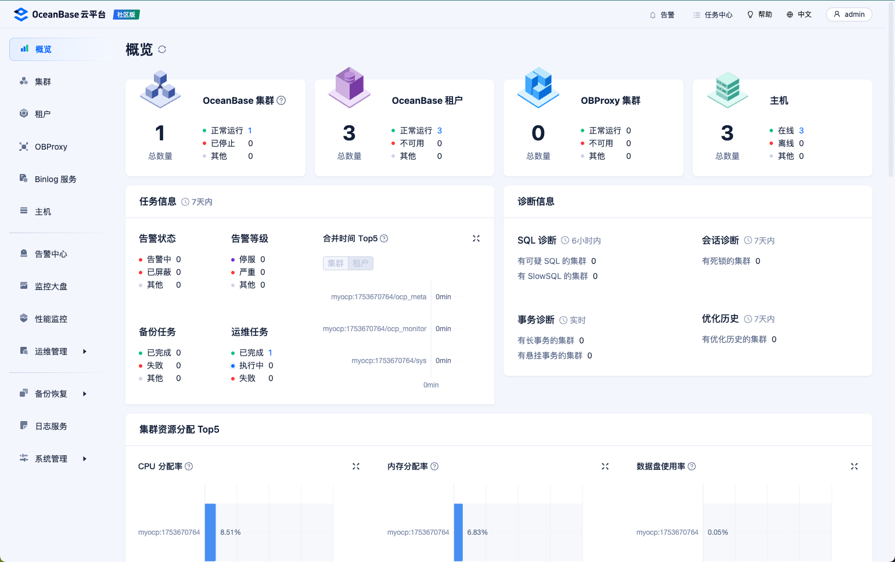

### FAQ

#### 1.  obd图形化界面URL地址无法打开

**解决方法:**  关闭防火墙

```bash
systemctl stop firewalld
systemctl disable firewalld
systemctl status firewalld
```

#### 2. 时钟同步问题: Cluster clocks are out of sync 

Please enable clock synchronization service

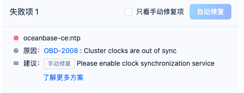

**解决方法：**

```bash
[root@localhost ~]# yum install ntpdate -y
[root@localhost ~]# ntpdate ntp.aliyun.com 
21 Apr 17:21:18 ntpdate[29201]: step time server 203.107.6.88 offset -2.902955 sec
```

#### 3. 服务器免密登录配置

**要求：**175.11.22.3 可以免密登录4-6服务器

**步骤：** 

1. 如果不存在目录/root/.ssh，则在4台服务器上统一执行ssh-keygen -t rsa
1. 将175.11.22.3上的/root/.ssh/id_rsa.pub拷贝到175.11.22.4-6服务器下的/root/.ssh/authorized_keys文件

#### 4. 集群同步配置

```shell
# config.sh

#!/bin/bash

for ip in {4..6} ; do
  echo  175.11.22.${ip} 
  scp -r optmize.sh 175.11.22.${ip}:/home
  ssh 175.11.22.${ip} bash /home/optmize.sh
done


# optmize.sh

#!/bin/bash
systemctl stop firewalld
systemctl disable firewalld
systemctl status firewalld
```


## OceabBase操作指导

### 启停OB集群

```shell
 obd cluster stop sysbench
 obd cluster start sysbench 
```

