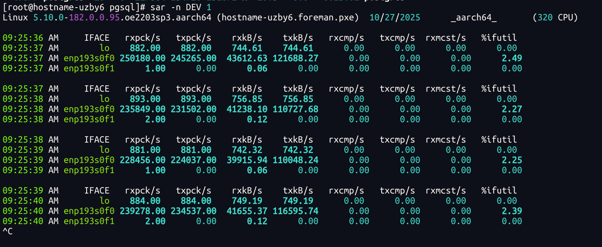
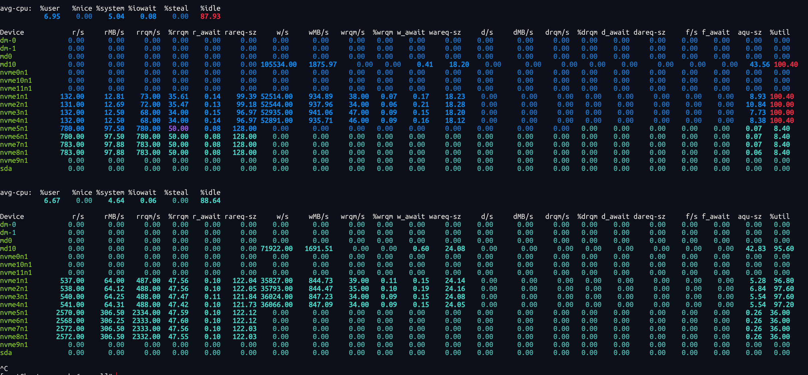
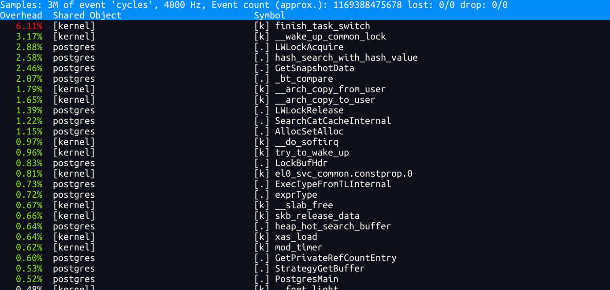
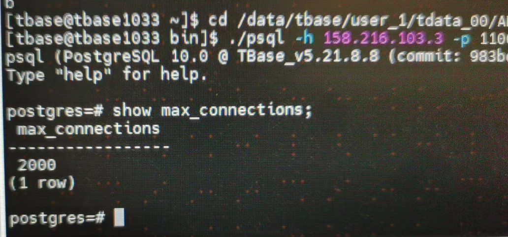
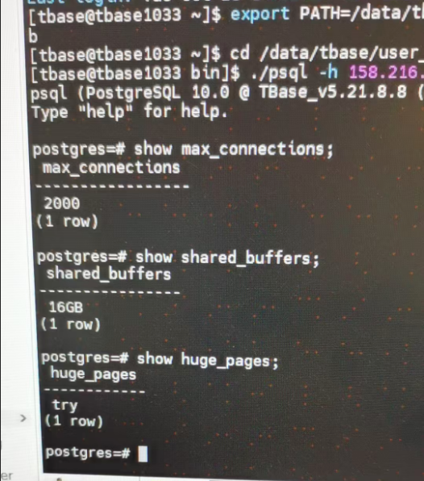

# PostgreSQL 性能测试

| 浙江农信tbase性能测试                                        | tpmC                | tpmTotal            | 性能提升比              |
| ------------------------------------------------------------ | ------------------- | ------------------- | ----------------------- |
| 基线                                                         |                     |                     |                         |
| BIOS 优化                                                    | 253852.83/241972.44 | 564125.91/538100.35 | --                      |
| numactl绑核（numactl -C 0-79）                               | 263745.06/258328.22 | 586616.76/573934.91 |                         |
| numactl绑核（numactl -C 0-79）重新生成数据后测试             | 290514.09/225227.11 | 646126.69/500689.23 | 14.44%/14.54%           |
| numactl绑核绑内存（numactl -N 2 -m 2）                       | 314409.35/213352.53 | 699710.82/474098.82 |                         |
| 大页内存                                                     |                     | 104723.97           | 配置的可能有点问题/回退 |
| 中断绑核                                                     |                     |                     |                         |
| 使能LSE                                                      | 254467.56           | 565541.1            | 性能下降                |
| 磁盘IO优化                                                   |                     |                     |                         |
|                                                              |                     |                     |                         |
|                                                              |                     |                     |                         |
| 重新测试numactl绑核（numactl -N 2）                          | 280579.21           | 623203.03           |                         |
| default_hugepagesz=1G hugepagesz=1G hugepages=512. 重新生成数据后测试 | 437576.88/432210.78 | 972439.71/959659.42 | 55.9%/                  |
|                                                              |                     |                     |                         |


### 大页内存配置

#### 临时配置

#### 持久化配置

```shell
vim /etc/grub2-efi.cfg
增加default_hugepagesz=1G hugepagesz=1G hugepages=512
增加default_hugepagesz=512M hugepagesz=512M hugepages=1024

[root@hostname-uzby6 ~]# cat /proc/meminfo | grep Hugepage
Hugepagesize:       2048 kB

[root@hostname-uzby6 ~]# grep Huge /proc/meminfo 
AnonHugePages:     47104 kB
ShmemHugePages:        0 kB
FileHugePages:         0 kB
HugePages_Total:       0
HugePages_Free:        0
HugePages_Rsvd:        0
HugePages_Surp:        0
Hugepagesize:       2048 kB
Hugetlb:               0 kB

reboot 


[root@hostname-uzby6 ~]# cat /proc/cmdline 
BOOT_IMAGE=/vmlinuz-5.10.0-182.0.0.95.oe2203sp3.aarch64 root=/dev/mapper/openeuler_hostname--uzby6-root ro nofb quiet splash=quiet rd.lvm.lv=openeuler_hostname-uzby6/root rd.lvm.lv=openeuler_hostname-uzby6/swap cgroup_disable=files apparmor=0 crashkernel=1024M,high smmu.bypassdev=0x1000:0x17 smmu.bypassdev=0x1000:0x15 default_hugepagesz=1G hugepagesz=1G hugepages=512
[root@hostname-uzby6 ~]# cat /proc/meminfo | grep Hugepage
Hugepagesize:    1048576 kB
[root@hostname-uzby6 ~]#  grep Huge /proc/meminfo
AnonHugePages:     49152 kB
ShmemHugePages:        0 kB
FileHugePages:         0 kB
HugePages_Total:     495
HugePages_Free:      495
HugePages_Rsvd:        0
HugePages_Surp:        0
Hugepagesize:    1048576 kB
Hugetlb:        519045120 kB


vim postgresql.conf 
shared_buffers = 200GB
huge_pages = on  # 测试验证try也可以
```


## PostgreSQL 安装

1. 关闭防火墙

   ```shell
   systemctl stop firewalld
   systemctl disable firewalld
   systemctl status firewalld
   ```

2. 创建用户和组

   ```shell
   groupadd postgres
   useradd -g postgres postgres
   passwd postgres
   # 配置密码Huawei12#$
   ```

3. 组Raid10 作为数据盘
   ```shell
   yum -y install mdadm
   mdadm  -Cv  /dev/md10  -a  yes  -n  4  -l  10  /dev/nvme1n1  /dev/nvme2n1  /dev/nvme3n1 /dev/nvme4n1
   mkfs.xfs -f /dev/md10  #耗时很长
   mount /dev/md10 /raid10 
   
   修改文件vim /etc/fstab
   增加/dev/md10 /raid10                   xfs    defaults        0 0
   ```

4. 安装依赖包

   ```shell
   yum -y install zlib-devel bzip2-devel bzip2-libs readline-devel ncurses-devel libaio-devel gmp-devel mpfr-devel libmpc-devel cmake gcc make 
   ```

5. 获取pg源码并编译

   ```shell
   cd /raid10
   wget https://ftp.postgresql.org/pub/source/v11.3/postgresql-11.3.tar.gz
   tar -xvf postgresql-11.3.tar.gz
   cd ./postgresql-11.3
   ./configure -prefix=/raid10/pgsql
   make -j 64
   make -j 64 install
   
   ```

6. 查看版本

   ```shell
   [root@hostname-uzby6 postgresql-11.3]# /raid10/pgsql/bin/postgres --version
   postgres (PostgreSQL) 11.3
   ```

7. 运行

   ```shell
   su postgres
   vim ~/.bash_profile 
   增加一行 export LD_LIBRARY_PATH=$LD_LIBRARY_PATH:/raid10/pgsql/lib
   source ~/.bash_profile
   /raid10/pgsql/bin/initdb -D /raid10/data/pgsql
   
   # 修改配置文件
   vim /raid10/data/pgsql/postgresql.conf 
   # 按照以下内容配置
   max_connections = 1000
   listen_addresses = '193.133.1.4'  
   
   # 启动数据库
   /raid10/pgsql/bin/pg_ctl -D /raid10/data/pgsql -l logfile start
   
   # 登录数据库
   /raid10/pgsql/bin/psql -U postgres 
   alter user postgres with password '123456';
   \q
   
   # 停止数据库
   /raid10/pgsql/bin/pg_ctl -D /raid10/data/pgsql -l logfile stop
   
   ```

8. 修改配置文件

   ```shell
   vim /raid10/data/pgsql/pg_hba.conf 
   增加一行 host    all             all             193.133.1.0/24          trust
   ```

9. 重新起停数据库


## BenchmarkSQL 安装压测

| 硬件名称 | 型号/版本                           |
| -------- | ----------------------------------- |
| CPU      | Kunpeng 920 7280Z  2p               |
| 内存     |                                     |
| 硬盘     |                                     |
|          |                                     |
| OS       | openEuler 22.03 (LTS-SP3)           |
| 内核     | 5.10.0-182.0.0.95.oe2203sp3.aarch64 |


| 软件名称        | 版本                                                         |
| --------------- | ------------------------------------------------------------ |
| java-11-openjdk | 1:11.0.27.6-1.oe2403sp1                                      |
| python3         | 3.11.6-17.oe2403sp1（python 版本请自己编译，替换成python2的版本： https://www.cnblogs.com/linuxjava/p/17456089.html） |
| benchmarksql    | 5.0                                                          |


> [!NOTE]
>
> 参考链接：
>
> 1. https://www.hikunpeng.com/forum/thread-0277153905728438019-1-1.html
> 2. https://www.hikunpeng.com/document/detail/zh/kunpengdbs/testguide/tstg/kunpengbenchmarksql_06_0001.html


1. 安装依赖

   ```shell
   yum install java python ant -y
   yum install -y snappy snappy-devel autoconf automake libtool   git gcc gcc-c++ make cmake openssl openssl-devel ncurses-devel zlib   zlib-devel bzip2 bzip2-devel bzip2-libs readline readline-devel bison zip unzip tar tcl
   ```

2. 下载源码包并解压

   ```shell
   wget https://sourceforge.net/projects/benchmarksql/files/latest/download/benchmarksql-5.0.zip
   unzip benchmarksql-5.0.zip
   cd benchmarksql-5.0
   ```

3. ant工具编译

   ```shell
   [root@hostname-5bjhi benchmarksql-5.0]# ant 
   Buildfile: /home/benchmarksql-5.0/build.xml
   
   init:
       [mkdir] Created dir: /home/benchmarksql-5.0/build
   
   compile:
       [javac] Compiling 11 source files to /home/benchmarksql-5.0/build
   
   dist:
       [mkdir] Created dir: /home/benchmarksql-5.0/dist
         [jar] Building jar: /home/benchmarksql-5.0/dist/BenchmarkSQL-5.0.jar
   
   BUILD SUCCESSFUL
   Total time: 0 seconds
   ```

4. 创建pg数据库tpcc

   ```shell
   create database tpcc;
   ```

5. 修改配置文件

   /home/benchmarksql-5.0/run/props.pg 

   ```shell
   db=postgres
   driver=org.postgresql.Driver
   conn=jdbc:postgresql://193.133.1.4:5432/tpcc
   user=postgres
   password=123456
   
   warehouses=1000
   loadWorkers=100
   
   terminals=150
   //To run specified transactions per terminal- runMins must equal zero
   runTxnsPerTerminal=0
   //To run for specified minutes- runTxnsPerTerminal must equal zero
   runMins=5
   //Number of total transactions per minute
   limitTxnsPerMin=0
   
   //Set to true to run in 4.x compatible mode. Set to false to use the
   //entire configured database evenly.
   terminalWarehouseFixed=true
   
   //The following five values must add up to 100
   //The default percentages of 45, 43, 4, 4 & 4 match the TPC-C spec
   newOrderWeight=45
   paymentWeight=43
   orderStatusWeight=4
   deliveryWeight=4
   stockLevelWeight=4
   
   // Directory name to create for collecting detailed result data.
   // Comment this out to suppress.
   resultDirectory=my_result_%tY-%tm-%td_%tH%tM%tS
   osCollectorScript=./misc/os_collector_linux.py
   osCollectorInterval=1
   //osCollectorSSHAddr=user@dbhost
   osCollectorDevices=enp193s0f0 blk_sda
   
   ```

6. 构建数据 & 测试

   ```shell
   ./runDatabaseBuild.sh props.pg
   
   ./runBenchmark.sh props.pg
   ./runDatabaseDestroy.sh props.pg
   ```

   


## FAQ

Q： 提升并发数到100并发后会报错 ERROR  jTPCC : Term-00, This session ended with errors!age: 83MB / 1963MB

A： 查看vim postgresql.conf 文件，发现最大连接数为max_connections = 100  ， 修改后重启数据库解决问题。

Q:  benchmarkSQL 加载数据报错： ERROR: Connection refused. Check that the hostname and port are correct and that the postmaster is accepting TCP/IP connections

A： 修改 listen_addresses = '193.133.1.4'  


## 性能分析

pg进程绑cpu：









TBase

配置文件位置


查询配置






