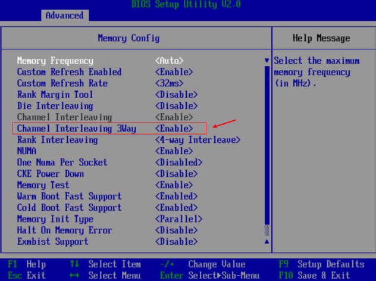

BIOS配置对性能的影响

[BIOS 参数参考 (鲲鹏920处理器)](https://support.huawei.com/enterprise/zh/doc/EDOC1100088653/98b06651?idPath=23710424|251364417|9856629|250697162)

---


## Power Policy

### 目的
> [!IMPORTANT]
>
> 确保CPU的频率一直与运行在最大

### 方法
#### 方法一
1.  在BIOS中，选择“BIOS->Advanced->Performance Config->Power Policy”
2.  设置“Power Policy”选项为“Performance”，按F10保存BIOS配置。
#### 方法二
```shell
# 使用当前目录下的BIOSTools-Kunpeng-3.3.0.aarch64.rpm
rpm -ivh BIOSTools-Kunpeng-3.4.0.aarch64.rpm
# 查询帮助文档
BIOSTools --help
# 查询配置
BIOSTools -D getbiosdetails -A CPUPrefetchConfig # 默认是Enabled
BIOSTools -D getbiosdetails -A DdrRefreshRate # 默认是32ms
BIOSTools -D getbiosdetails -A CustomPowerPolicy # 默认是Efficiency
BIOSTools -D getbiosdetails -A NUMAEn #默认是Enable
# 更改配置 (需要重启后生效)
BIOSTools -A CPUPrefetchConfig -V Disabled
BIOSTools -A DdrRefreshRate -V Auto
BIOSTools -A CustomPowerPolicy -V Performance
BIOSTools -A NUMAEn -V Enabled
```

## Custom Refresh Rate

### 目的
> [!IMPORTANT]
>
> 提升内存读写访存性能。

### 方法
#### 方法一
1. 在BIOS中，选择“Advanced > Memory Config > Custom Refresh Rate”
2. 设置“Custom Refresh Rate”选项为“Auto”，按F10保存BIOS配置。
#### 方法二
参考Power Policy

## CPU Prefetching Configuration

### 目的
> [!IMPORTANT]
>
> 关闭CPU预取：CPU将内存中的数据读到CPU的高速缓冲Cache时，会根据局部性原理，除了读取本次要访问的数据，还会预取本次数据的周边数据到Cache里面，如果预取的数据是下次要访问的数据，那么性能会提升，如果预取的数据不是下次要取的数据，那么会浪费内存带宽。对于数据比较集中的场景，预取的命中率高，适合打开CPU预取，反之需要关闭CPU预取。

### 方法
#### 方法一
1. 在BIOS中，选择“Advanced>MISC Config”，按Enter进入。
2. 将“CPU Prefetching Configuration”设置为“Disabled”，按F10保存退出。
#### 方法二
参考Power Policy

## NUMA
### 目的

> [!IMPORTANT]
>
> ARM环境下需要开启NUMA，默认开启

### 方法
#### 方法一
1.	服务器重启，进入BIOS，依次选择”BIOS->Advanced->Memory Config -> NUMA”
2.	设置“ NUMA”选项为“Enable”，按F10保存BIOS配置。


## Channel Interleaving 3Way

### 目的

> [!IMPORTANT]
>
> 内存交织技术，是指根据内存通道配置的内存数量，进行交叉编址。上层带内看到的是一段连续的内存地址，实际上会映射到不同的内存通道上，即带内的数据访问时会在不同的内存条上进行访问，通过这种方式可以同时利用多个内存通道，提升内存带宽。

​	主要是在未满配或者未配置一半内存条的情况（例如：配置24/32条内存的场景）打开。在插了24/32条内存的服务器上，未打开Channel Interleaving 3Way的时候，每个CPU下的内存交织情况为 2 + 1路，OS侧访问内存存在如下情况：

| 跨Die访问1路交织   | 性能最差             |
| ------------------ | -------------------- |
| 不跨Die访问1路交织 | 较差                 |
| 跨Die访问1路交织   | 较好                 |
| 不跨Die访问2路交织 | 性能最好（相对而言） |

​	

> [!NOTE]
>
> Channel Interleaving 3Way 默认是开启的，但是开启后会导致OS内4GB以下大段连续可用内存变少，部分客户想用更多的大段连续内存，所以可能关闭该BIOS选项。
>
> Gauss DB数据库会考虑关闭Channel Interleaving 3Way（4G连续可用内存不足，导致无法生成vmcore），此时内存尽量满配，否则会影响访存速率


### 方法

​	

### 实验

	- Channel Interleaving 3Way 对于8/32条内存安装的情况基本**没有影响**

8/32条内存stress压测结果

|       | stress整机 + 关闭Channel Interleaving 3Way | stress整机 + 开启Channel Interleaving 3Way | stress单核 + 关闭Channel Interleaving 3Way | stress单核 + 开启Channel Interleaving 3Way |
| ----- | ------------------------------------------ | ------------------------------------------ | ------------------------------------------ | ------------------------------------------ |
| Copy  | 106496.2                                   | 115277.9                                   | 11032.7                              | 10831.6                                    |
| Scale | 108533.5                                   | 107334.7                                   | 11617.1                              | 11620.6                                    |
| Add   | 108088.1                                   | 110800.1                                   | 12507.0                              | 12299.7                                    |
| Triad | 105777.6                                   | 110880.1                                   | 12491.1                                    | 12308.7                                    |

	- Channel Interleaving 3Way 对于24/32条内存安装的情况，**整机大概有10%的性能提升，单核有20%的提升**

24/32条内存stress压测结果

|       | stress整机 + 关闭Channel Interleaving 3Way | stress整机 + 开启Channel Interleaving 3Way | stress单核 + 关闭Channel Interleaving 3Way | stress单核 + 开启Channel Interleaving 3Way |
| ----- | ------------------------------------------ | ------------------------------------------ | ------------------------------------------ | ------------------------------------------ |
| Copy  |      119806.5                              |      133803.3                              |     11624.1                                |      14959.3                               |
| Scale |      125980.5                              |      140108.2                              |     12528.1                                |      13462.2                               |
| Add   |      130701.2                              |      158972.1                              |     12883.0                                |      15635.1                               |
| Triad |      141872.2                              |      140223.7                              |     13162.0                                |      15578.8                               |

## DEMT

### 目的

> [!IMPORTANT]
> 
> 选择动态能耗管理技术模式。(默认为Disabled， 可选模式 ["Disabled", "Fast Mode", "Smooth Mode"])
> 
> 优先级比Power Policy高
> 
>使用快速调整模式时，频率调整速度较快。当CPU负载不低于90%时，CPU立即升到最高频率运行；当CPU负载低于90%时，CPU快速降到最低频率运行。
使用平滑调整模式时，频率调整速度较慢。当CPU负载不低于90%时，CPU平滑升到最高频率运行；当CPU负载低于90%时，CPU平滑降到最低频率运行。
> 
### 作用
```shell
# 当DEMT设置为Fast Mode，且当前CPU使用率极低时， perf stat 查询到真实的cpu频率仅为1.599GHz。
[root@hostname-kvvcy ~]# perf stat --timeout 3000 bash -c "while true; do continue; done"
 Performance counter stats for 'bash -c while true; do continue; done':
        179,814.93 msec task-clock                #    1.000 CPUs utilized
                54      context-switches          #    0.000 K/sec
                 0      cpu-migrations            #    0.000 K/sec
                62      page-faults               #    0.000 K/sec
   287,604,525,772      cycles                    #    1.599 GHz
   647,245,465,162      instructions              #    2.25  insn per cycle
```

### 方法

#### 方法一
1.  在BIOS中，选择“BIOS->Advanced->DEMT”
2.  设置“DEMT”选项为“Disable”，按F10保存BIOS配置。
#### 方法二
```shell
BIOSTools -D getbiosdetails -A DemtMode
BIOSTools -A DemtMode -V Disabled
```
---

## CacheMode

### 目的

> [!IMPORTANT]
>
> 久同反馈可以在4p 920设备上使用，没有限制说只有数据库场景可以使用，只要4p服务器都可以使用。


### 方法

#### 	方法一

```shell
BIOSTools -D getbiosdetails -A CacheMode
BIOSTools -A CacheMode -V "in:private out:private"
```


## 模版

### 目的

> [!IMPORTANT]
>
> 

### 方法

#### 	方法一


```shell
# 使用当前目录下的BIOSTools-Kunpeng-5.1.aarch64.rpm (需要root权限)
rpm -ivh BIOSTools-Kunpeng-5.1.aarch64.rpm

# 查询配置
BIOSTools -D getbiosdetails -A CPUPrefetchConfig
BIOSTools -D getbiosdetails -A DdrRefreshRate
BIOSTools -D getbiosdetails -A CustomPowerPolicy
BIOSTools -D getbiosdetails -A NUMAEn

```

