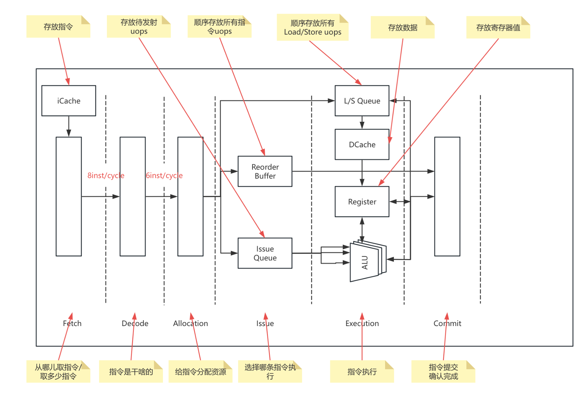
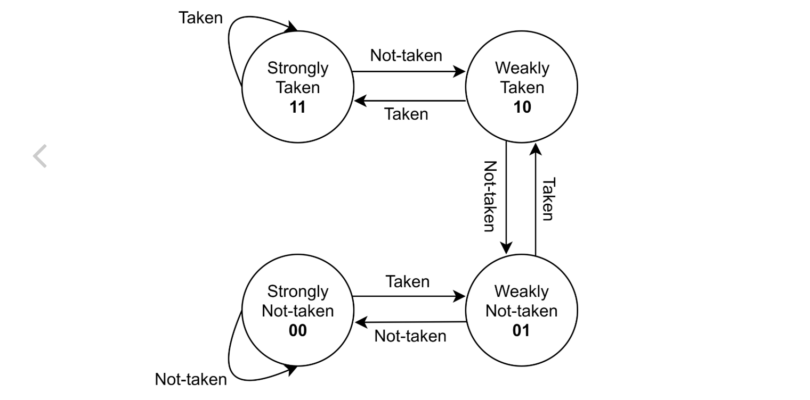
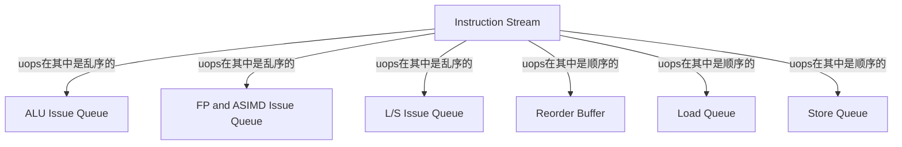
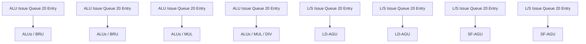
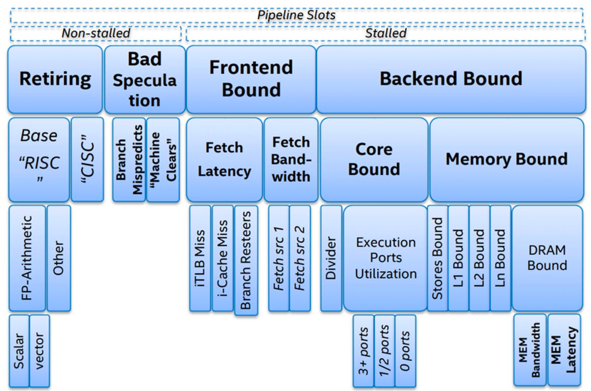
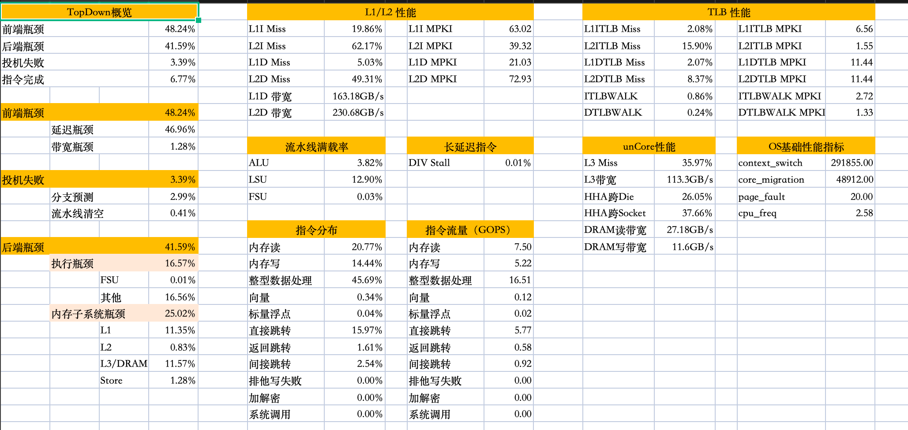

## 基础概念

1. 指令集架构：指处理器与软件之间的接口规范，定义了处理器支持的指令集
2. 微架构：指令集的不同硬件实现方式，由处理器内部各个硬件组成。（微架构在性能和功耗上表现不同）
3. 执行的时延：指令从发射到执行完成所花费的cycle数
4. 执行的带宽：平均每个周期最多能同时执行的指令数量


## 微架构分类


> 目的：提升微架构的ILP（Instruction Level Parallelism）能力


1. 流水/非流水（Pipelined/Nonpipelined）：不同的指令是否可以在不同的流水阶段同时执行
2. 标量/超标量（Scalar/Superscalar）：每个流水阶段是否可以同时处理多条指令
3. 按序/乱序（In-Order/Out-of-Order）：指令完成执行阶段的顺序是否一定要遵循二进制的顺序
4. 向量/超线程（Vector/HyperThread）： 支持向量指令集？支持超线程？


|             | Kunpeng 920 | Kunpeng 920B | Kunpeng 920C |
| ----------- | ----------- | ------------ | ------------ |
| 流水/非流水 | 流水        | 流水         | 流水         |
| 标量/超标量 | 超标量      | 超标量       | 超标量       |
| 按序/乱序   | 乱序        | 乱序         | 乱序         |
| 向量        | 支持        | 支持         | 支持         |
| 超线程      | 不支持      | 支持         | 支持         |


## 流水线的竞争与冒险 Stall

举例： 理想状态IPC=2  （Instructions per cycle）

1. 数据冒险（Data Hazards）：第二条指令依赖第一条指令产生的结果，导致等待，无法流水或超标量执行
2. 结构冒险（Structual Hazards）： 
   - 指令中存在多周期且无法流水化的阶段，后续指令需要等待该指令多周期执行完成后才能执行
   - 某条指令需要独占受限资源，导致指令无法流水执行
3. 控制冒险（Control Hazards）： 下一条指令需要根据上一条指令的分支判断来决定，导致得等上一条指令完成才能执行


## 超标量乱序微架构主要流水阶段

发射数（微架构IPC理论上限）：由各个流水线阶段中最窄的部分决定。（e.g., Decode解码阶段为6IPC，那么其它无论IPC多高，发射数都不会高于6IPC）



### 缓存

|                   | Kunpeng 920 | Kunpeng 920B | Kunpeng 920C |
| ----------------- | ----------- | ------------ | ------------ |
| L1I Cache         | 64KB 4-Way  | 64KB 4-Way   | 128KB 4-Way  |
| L1D Cache         | 64KB 4-Way  | 64KB 4-Way   | 64KB 4-Way   |
| L2 Cache          | 512KB       | 1MB/1.25MB   | 1MB          |
| DCache Load Port  | 2           | 2            | 3            |
| DCache Store Port | 1           | 2            | 2            |

### 取值 Instruction Fetch

当遍历指令数据大小在L1I Cache范围内，Kunpeng 920B取指带宽在6 IPC左右；当遍历指令数据大小在L2 Cache范围内时，Kunpeng 920B取指带宽在、5.7 IPC左右。


> 如果类型为条件分支指令, 则需要访问模式历史表 (PHT，e.g., 如下图的两位饱和计数器) 来判断是否跳转; 如果类型为返回指令, 则选择返回地址栈 (RAS) 的栈顶内容作为跳转目标; 如果类型为直接或间接跳转指令, 则选择 BTB 中记录的跳转目标。[参考链接](https://oscpu.github.io/NutShell-doc/%E5%8A%9F%E8%83%BD%E9%83%A8%E4%BB%B6/bpu.html)

- 分支目标预测

1. BTB（分支目标缓冲区）：利用PC索引，存储分支指令的跳转地址。 [参考链接](https://www.zhihu.com/question/645121724/answer/3403546257)

​	[分支目标缓冲](https://zhida.zhihu.com/search?content_id=648903437&content_type=Answer&match_order=1&q=分支目标缓冲&zhida_source=entity)（Branch Target Buffer，简称BTB）是CPU中用于提高分支指令执行效率的一种机制。它主要用于预测分支指令的目标地址，以便在[程序流水线](https://zhida.zhihu.com/search?content_id=648903437&content_type=Answer&match_order=1&q=程序流水线&zhida_source=entity)中提前加载正确的指令，从而避免由于分支指令带来的流水线停顿。

​	**【**更新策略】当分支执行时，BTB可能需要更新。更新的方式通常取决于分支是否被正确预测。如果预测正确，可能会更新相关的历史信息，以提高下一次的预测准确性。如果预测错误，可能会清除相关的历史信息，避免类似的错误发生。具体更新方式如下所示，如果不在BTB中且不是分支指令，就正常执行，若是分支指令，则添加当前表项；如果在BTB中且taken，则正常执行，否则重性取值，删去BTB中对应表项。

2. RAS（返回地址调用栈）： 利用函数调用原理，用栈存储返回地址。

- 分支方向预测

1. 静态预测：对于某一类型分支采取固定方向预测。
2. 动态预测：基于分支过去执行的历史信息进行预测。（e.g., 如下图的两位饱和计数器）



|      | Kunpeng 920                   | Kunpeng 920B                                | Kunpeng 920C                                   |
| ---- | ----------------------------- | ------------------------------------------- | ---------------------------------------------- |
| BTB  | L0 BTB 64项<br/>L1 BTB 4K项； | L0 BTB 64项<br/>L1 BTB 1K项<br/>L2 BTB 4K项 | L0 BTB 128项<br/>L1 BTB 1K项<br/>L2 BTB ～8K项 |
| RAS  | 32项                          | 16项                                        | 16项                                           |


### 解码 Decode

1. 判断指令的类型（e.g., 控制指令、访存指令、算数指令等）
2. 判断指令需要执行的操作（e.g., 具体的算数操作、分支指令需要计算哪种条件）
3. 判断指令需要的资源（e.g., 哪些寄存器）

|              | Kunpeng 920                    | Kunpeng 920B | Kunpeng 920C |
| ------------ | ------------------------------ | ------------ | ------------ |
| Decode Width | 4 （每个cycle可以解码4条指令） | 6            | 8            |

### 分配

#### 寄存器重命名 Register Rename

| 数据依赖/真依赖（生产者必须先于消费者执行） | 名称依赖/伪依赖                       | 名称依赖/伪依赖                       |
| ------------------------------------------- | ------------------------------------- | ------------------------------------- |
| ADD **X1**,X2,X3<br/>ADD x5,**X1**,X4       | ADD **X1**,X2,X3<br/>ADD **X1**,X4,X5 | ADD X1,**X2**,X3<br/>ADD **X2**,X4,X5 |
| read after write                            | write after write                     | write after read                      |

伪依赖的存在导致指令无法并行执行，可以通过物理寄存器解决WAW和WAR依赖问题。

**[实现]**通过Reg Map Table判断是使用架构寄存器还是物理寄存器。（编译的时候只能知道架构寄存器）

|                     | Kunpeng 920 | Kunpeng 920B | Kunpeng 920C |
| ------------------- | ----------- | ------------ | ------------ |
| 整形物理寄存器      | ～106       | ～160        | ～186        |
| 浮点/向量物理寄存器 | ～64        | ～136        | ～186        |

#### 指令派发 Instruction Dispath 



​	派发阶段的主要工作

	1. 保留将来使用的一些资源，包括发射队列（Issue Queue）、重排列缓冲区（Reorder Buffer）和加载/存储队列（Load /Store Queue），如果任何所需资源不可用，则指令将暂停，直到它们可用。
	1. 在多个可选资源中确定要使用哪个，比如有多个执行单元，派发阶段需要根据算法选择其中一个。


### 发射 Issue

从ALU Issue Queue中可发射的指令中选取一条进行发射（e.g., ADD X1,X2,X3）。

​	

### 执行 Execute



1. ALUs (arithmetic and logical unit single)： 完成单周期简单整型运算 e.g. 整数加减法、位操作
2. ALUm (arithmetic and logical unit multi)： 完成多周期简单整型运算 e.g. 整型乘法、除法 
3. AGU（address generation unit）： 计算访存指令中的地址
4. BRU（Branch unit）： 基于不同分支指令类型计算跳转地址、绝对地址、相对地址和间接地址
5. FPU：完成浮点类型算数运算
6. SIMD unit： 完成对一组元素并行执行相同操作的指令（NEON、SVE、SSE、AVX）

|              | ALU  | MUL  | DIV  | LD-AGU | ST-AGU | BRU  | FPU  | ASIMD | SVE  |
| ------------ | ---- | ---- | ---- | ------ | ------ | ---- | ---- | ----- | ---- |
| kunpeng 920  | 3    | 1    | 1    | 2      | 1      | 2    | 2    | 2     | /    |
| kunpeng 920B | 4    | 2    | 1    | 2      | 2      | 2    | 4    | 4     | 2    |
| kunpeng 920C | 6    | 3    | 3    | 3      | 2      | 3    | 4    | 4     | 2    |


### 提交  Commit/Retire

1. 架构状态： 包括内存加上每个逻辑寄存器的值，只在提交时更新，就像处理器将按顺序执行指令一样，程序员是可观测的。
2. 推测状态：架构状态加上处理器中正在运行的指令所执行的修改。


在Reorder Buffer队列中，当非队列头的指令2完成write-back时，只能修改推测状态，不能修改架构状态。否则当队列头的指令1触发异常时，指令2修改了架构状态，此时的架构状态是错误的。


##  微架构瓶颈定位方法 Topdown




## Topdown瓶颈问题优化

1. 前端瓶颈问题：
   - iTLB miss问题可以通过内存大页解决/ JVM启动参数也可以开启内存大页
   - PGO进行指令重排序/ JDK17也支持指令重排序
2. 后段瓶颈问题：
   - ~~执行瓶颈可以看看perf top热点函数~~
   - 或者看看有没有访存瓶颈


## kperf 使用

> [!NOTE]
>
> kperf 需要放置在/usr/bin目录下执行

[arm kperf v2.5.3工具下载](https://gitee.com/robinadc/kunpeng-pae/blob/master/bin/kperf)

[新版arm kperf v2.5.4](../../附件/kperf)

### 简单指标查看

```shell
[root@localhost jesse]# ./kperf --topdown --pid 51465 
architecture kunpeng920
collect pid 51465

====================== TopDown Metric ======================
---------------------- frontend bound ----------------------
frontend_bound:                          48.27%
frontend_latency_bound:                    |-- 46.85%
frontend_bandwidth_bound:                  |--  1.42%
------------------------- bad spec -------------------------
bad_spec:                                 3.31%
mispred:                                   |--  2.91%
mclear:                                    |--  0.40%
------------------------- retiring -------------------------
retiring:                                 6.74%
----------------------- backendbound -----------------------
backend_bound:                           41.68%
core_bound:                                |-- 16.61%
core_fsu_bound:                                  |--  0.01%
core_other_bound:                                |-- 16.60%
mem_bound:                                 |-- 25.07%
mem_l1_bound:                                    |-- 11.40%
mem_l2_bound:                                    |--  0.82%
mem_l3_dram_bound:                               |-- 11.66%
mem_store_bound:                                 |--  1.19%
```

### 全量指标查看

> 确保收集40个采样点，大概10分钟

```shell
## 会在当前目录下生成一个excel文件查看（如下图所示）
./kperf --rawdata --hotfunc --topdown --cache --tlb --imix --uncore --verbose --duration 1 --interval 15 --pid 51465 --excel kperf
```


