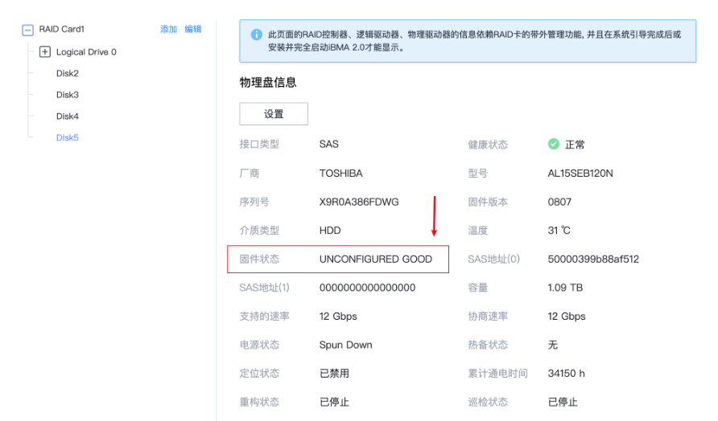
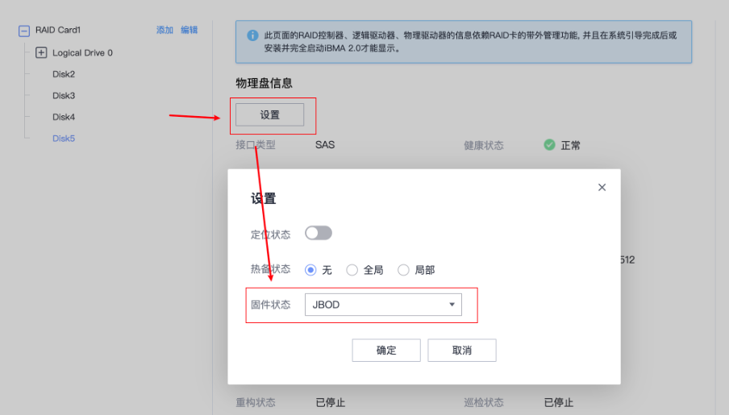

> [!NOTE]
>
> 记录一些磁盘相关的FAQ，主要包含一些基本的问题定位和解决方法


## 1. lsblk无法查看到磁盘，但是iBMC中能查看到磁盘

```shell
[root@hostname-3t65t ~]# lsblk 
NAME                               MAJ:MIN RM   SIZE RO TYPE MOUNTPOINTS
sda                                  8:0    0 893.1G  0 disk 
├─sda1                               8:1    0   600M  0 part /boot/efi
├─sda2                               8:2    0     1G  0 part /boot
└─sda3                               8:3    0 891.5G  0 part 
  ├─openeuler_hostname--3t65t-root 253:0    0    70G  0 lvm  /
  ├─openeuler_hostname--3t65t-swap 253:1    0     4G  0 lvm  [SWAP]
  └─openeuler_hostname--3t65t-home 253:2    0 817.5G  0 lvm  /home
[root@hostname-3t65t ~]# df -h 
Filesystem                                  Size  Used Avail Use% Mounted on
devtmpfs                                    4.0M     0  4.0M   0% /dev
tmpfs                                       126G     0  126G   0% /dev/shm
tmpfs                                        51G   20M   51G   1% /run
tmpfs                                       4.0M     0  4.0M   0% /sys/fs/cgroup
/dev/mapper/openeuler_hostname--3t65t-root   69G  2.2G   63G   4% /
tmpfs                                       126G     0  126G   0% /tmp
/dev/sda2                                   974M  126M  781M  14% /boot
/dev/sda1                                   599M  6.5M  593M   2% /boot/efi
/dev/mapper/openeuler_hostname--3t65t-home  804G  191M  763G   1% /home
```



解决方法：点击物理盘信息的设置按钮，并修改固件状态为JBOD或者ONLINE即可



完成配置后，lsblk即显示对应ONLINE的盘

```bash
[root@hostname-3t65t ~]# lsblk 
NAME                               MAJ:MIN RM   SIZE RO TYPE MOUNTPOINTS
sda                                  8:0    0 893.1G  0 disk 
├─sda1                               8:1    0   600M  0 part /boot/efi
├─sda2                               8:2    0     1G  0 part /boot
└─sda3                               8:3    0 891.5G  0 part 
  ├─openeuler_hostname--3t65t-root 253:0    0    70G  0 lvm  /
  ├─openeuler_hostname--3t65t-swap 253:1    0     4G  0 lvm  [SWAP]
  └─openeuler_hostname--3t65t-home 253:2    0 817.5G  0 lvm  /home
sdb                                  8:16   0   1.1T  0 disk 
├─sdb1                               8:17   0   600M  0 part 
├─sdb2                               8:18   0     1G  0 part 
└─sdb3                               8:19   0   1.1T  0 part 
[root@hostname-3t65t ~]#
```

