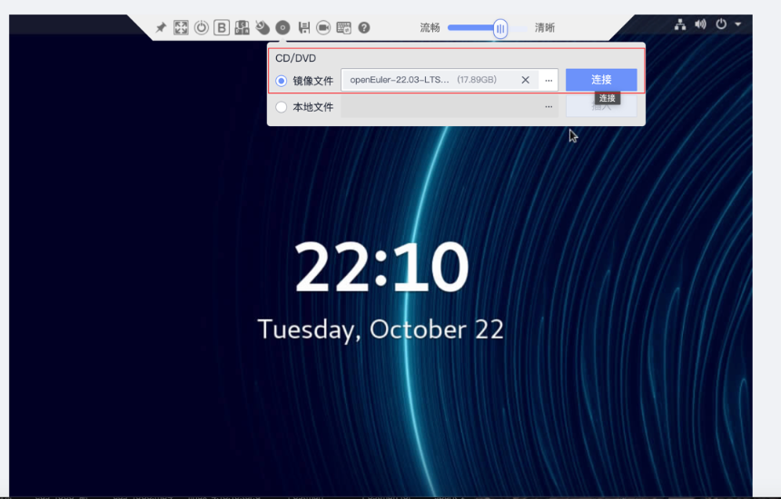
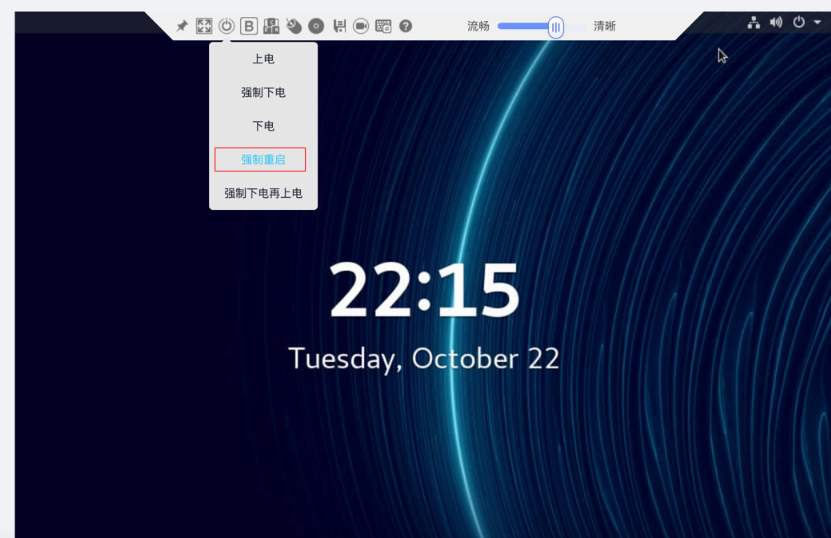
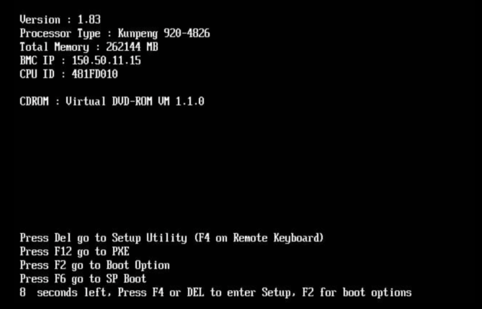
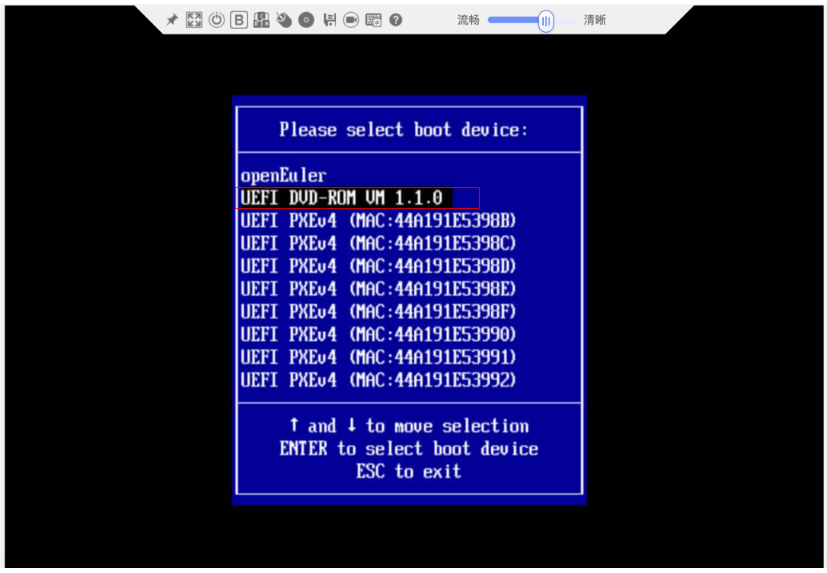
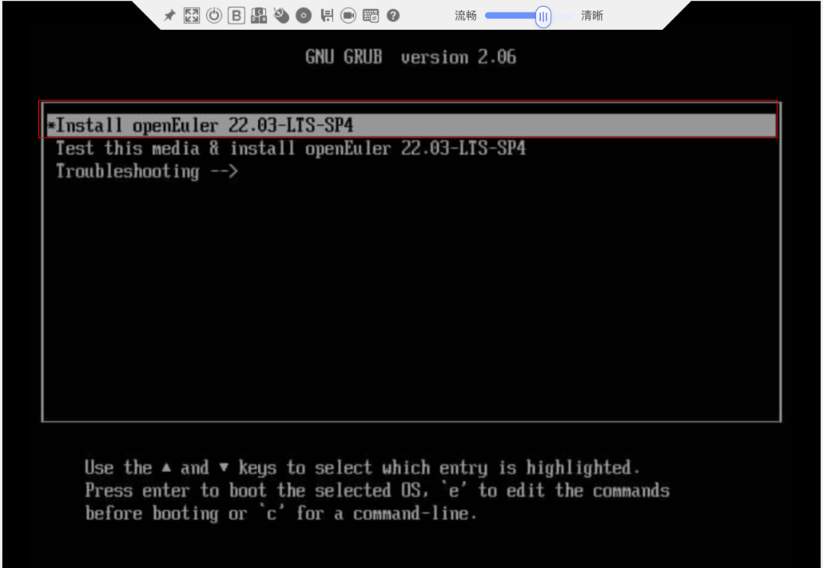
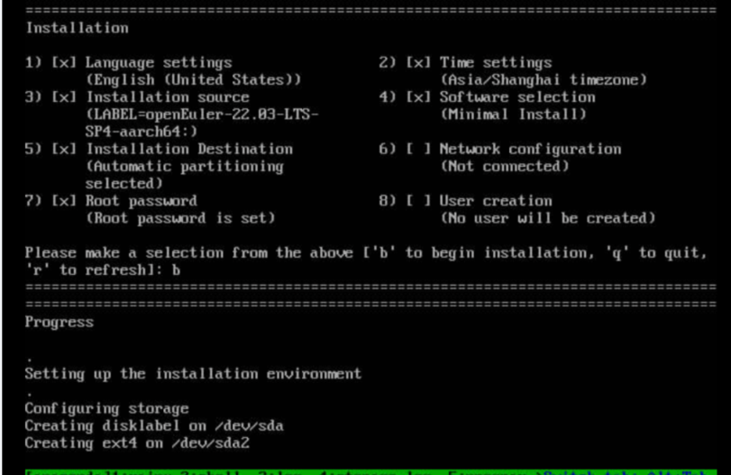
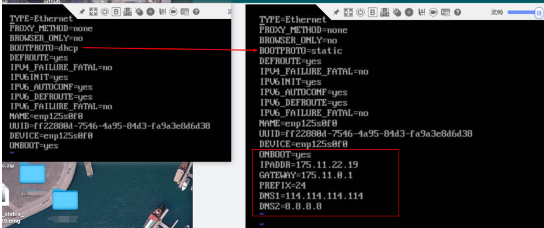
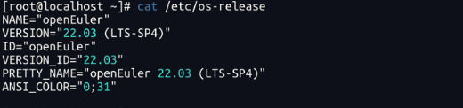

# 通过BMC重装操作系统

## 登陆iBMC


## 点击光驱工具后选择镜像文件



## 点击连接直到状态变更为断开，则表示虚拟光驱已连接服务器


## 重启服务器



## 按F2 进入Boot Option (有时候是F11)



> 进入后需要输入密码： Admin@9000

## 选择CDROM启动项



## 选择安装的操作系统

如果选择Test，那么安装时间会比较长



## 完成基本配置后启动安装

也可能是图形化界面



## ip配置

```shell
vi /etc/sysconfig/network-scripts/ifcfg-enp125s0f0

#修改
BOOTPROTO=static
ONBOOT=yes

#添加
IPADDR=175.11.22.19
GATEWAY=175.11.0.1
PREFIX=24
DNS1=114.114.114.114
DNS2=8.8.8.8
```




```shell
# 重新加载配置文件
nmcli c reload
# 如果是up的端口，则需要先down掉
nmcli c down enp189s0f0 
nmcli c up enp189s0f0
```

## 查看操作系统版本



## 附录

默认的管理口配置

```shell
NETMASK=255.255.192.0
DNS1=223.5.5.5
DNS2=8.8.8.8
IPADDR=175.11.22.4
GATEWAY=175.11.0.1
TYPE=Ethernet
PROXY_METHOD=none
BROWSER_ONLY=no
BOOTPROTO=static
DEFROUTE=yes
IPV4_FAILURE_FATAL=no
IPV6INIT=yes
IPV6_AUTOCONF=yes
IPV6_DEFROUTE=yes
IPV6_FAILURE_FATAL=no
NAME=enp125s0f0
UUID=0f86d1ce-4c5f-48f8-aa7b-b3c413c9768a
DEVICE=enp125s0f0
ONBOOT=yes
```

默认的业务口配置

```shell
NETMASK=255.255.192.0
DNS1=223.5.5.5
DNS2=8.8.8.8
IPADDR=192.11.22.4
GATEWAY=192.11.0.1
TYPE=Ethernet
PROXY_METHOD=none
BROWSER_ONLY=no
BOOTPROTO=static
DEFROUTE=yes
IPV4_FAILURE_FATAL=no
IPV6INIT=yes
IPV6_AUTOCONF=yes
IPV6_DEFROUTE=yes
IPV6_FAILURE_FATAL=no
NAME=enp189s0f0
UUID=0810c644-47bd-470c-9e29-8b970f916089
DEVICE=enp189s0f0
ONBOOT=yes
```

